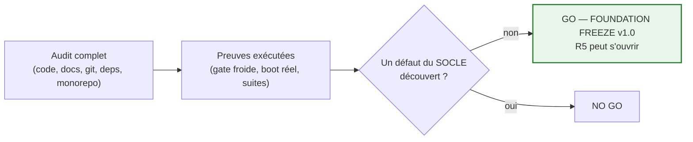

# Foundation Acceptance

**MentoraOS — FOUNDATION FREEZE v1.0 — Décision d'acceptation**

| | |
|---|---|
| **Version** | 1.0 |
| **Statut** | Soumis à la signature du CTO |
| **Base factuelle** | [Foundation Freeze Report](foundation-freeze-report.md) · [Foundation Inventory](foundation-inventory.md) · [Foundation Roadmap](foundation-roadmap.md) |

---

## 1. La Foundation est-elle prête ?

**Oui.**

## 2. Pourquoi ?

Parce que chacune des couches dont R5 aura besoin existe, est gelée, et est **prouvée par exécution** — pas par affirmation :

1. **La loi existe et est opposable** : Constitution F1→F5 gelée (Titre VII seule voie), matérialisée à 100 % dans `docs/canon/` avec ses projections et sa publication ; PCR-001 signé.
2. **La machinerie existe et tourne** : les dix paquets Runtime Foundation ne sont pas une bibliothèque en attente — ils font tourner un processus réel qui boote fail-closed, sert ses trois surfaces et meurt proprement.
3. **La persistance existe et applique les lois du domaine dans le moteur** : la clé R-A est une contrainte PostgreSQL, la rétention est UNE transaction sérialisable ordonnée, la reconstruction est photo+delta(0) — tout rejoué par contract suites sur le moteur réel.
4. **La circulation existe jusqu'à sa frontière actuelle** : l'Outbox de faits naît dans la rétention, le relais réclame par sujet, publie, pardonne les claims expirés, quarantaine avec témoins — et la boucle complète commande→rétention→relais→lecture est un test qui passe.
5. **L'organisation humaine existe avant les humains** : sièges, échelle, manuel quotidien — R5 peut accueillir un ingénieur demain matin avec un parcours d'onboarding défini.
6. **La gouvernance Git existe** : dépôt officiel, branches gouvernées, tag publié, histoire linéaire intacte (51 commits, zéro réécriture).

## 3. Quelles preuves ?

| Preuve | Verdict |
|---|---|
| Gate froide complète (0 cache), workspace entier, base réelle | **112/112 tâches, 0 erreur, 0 warning** (exécutée le jour du gel) |
| Marqueurs expérimentaux dans le code | 0 (l'unique TODO est un artefact de conception délibéré du générateur) |
| Liens documentaires | 1 373 relatifs vérifiés, 0 cassé |
| Cycles / violations de couches | 0 — prouvé par suite d'architecture exécutable |
| Boot réel | Processus vivant démontré (2B-3) : 200 sur les trois surfaces, extinction propre |
| Contract suites sur infrastructure réelle | Relais et persistance : la même suite passe sur la référence mémoire ET sur PostgreSQL |
| Couvertures des lots gelés | ≥95/95/95 partout (2B-1 98,5/96,9/100 · 2B-2 100/95,4/100 · 2B-3 100/96,9/100) |
| Git | Branches alignées, tag `foundation-v1.0.0`→`8d095ee` intact local+distant |

## 4. Quelles limites ? (dites honnêtement)

1. **Un seul domaine implémenté sur quinze** — la Foundation prouve le *rituel* (domaine→application→adapters→exécutable), pas la couverture fonctionnelle. C'est exactement ce qu'une Foundation doit prouver ; l'expansion est R7.
2. **Aucune entrée du monde réel** — pas d'API publique, pas de broker, pas d'I&A : c'est la définition même de R5, pas un manque du socle.
3. **Protections GitHub absentes** et branche par défaut non basculée — la phase GitHub Governance est définie mais non exécutée ; risque réel dès qu'une deuxième paire de mains pousse.
4. **Pendants Titre VII connus** (corrélation dans le port de rétention, projections, NoShowSettlementProcess, raisons de refus de lecture) — instruits AVANT le lot qui les rencontre, jamais improvisés.
5. **Environnement de dev Windows** : SIGTERM externe non prouvable (le drainage est prouvé par injection), runner turbo occasionnellement transitoire, et la leçon du zombie (Freeze Report §12 R-1) : l'hygiène des processus conditionne la stabilité des suites DB.
6. **Dettes signalées et assumées** : store durable de Journal, vault (I-8), scission des espèces, versement de l'héritage documentaire, micro-dépendance R-8.

Aucune de ces limites n'est une inconnue : chacune a un propriétaire de phase dans la roadmap.

## 5. Que reste-t-il avant R5 ?

Dans l'ordre (détail : Freeze Report §13) : (1) poussée des commits de gouvernance + propagation aux branches officielles ; (2) phase GitHub Governance (protections, défaut→main, CODEOWNERS) ; (3) ratification de la roadmap ; (4) instruction des pendants Titre VII que le premier lot touchera. Les points 1-2 sont des opérations ordonnables en minutes ; rien n'exige de nouveau code.

## 6. Décision

# VERDICT : **GO**

**FOUNDATION FREEZE v1.0 — GO.**

**Justification** : l'audit n'a découvert **aucun défaut du socle**. Tout ce qui a été trouvé appartient à trois catégories : (a) opérations ordonnées mais non encore exécutées (poussées, protections GitHub) — des actes, pas des inconnues ; (b) dettes *signalées de longue date* avec leur phase propriétaire dans la roadmap ; (c) une leçon d'hygiène d'environnement (le zombie) qui a été instruite, corrigée et documentée pendant l'audit même — et dont la résolution a précisément re-démontré la solidité du socle : une fois l'environnement assaini, les 112 tâches repassent à froid sans une seule retouche du code gelé.

Le gel est prononcé sous une seule **condition suspensive** pour le premier lot de code R5 : l'exécution préalable de la phase GitHub Governance (protections + branche par défaut). Les lots documentaires et d'instruction de R5 peuvent, eux, s'ouvrir immédiatement.

*La signature du CTO transforme ce verdict en acte. Jusqu'à elle, ce document est prospectif (discipline PCR-001 : PRÊT ≠ ÉMIS).*
