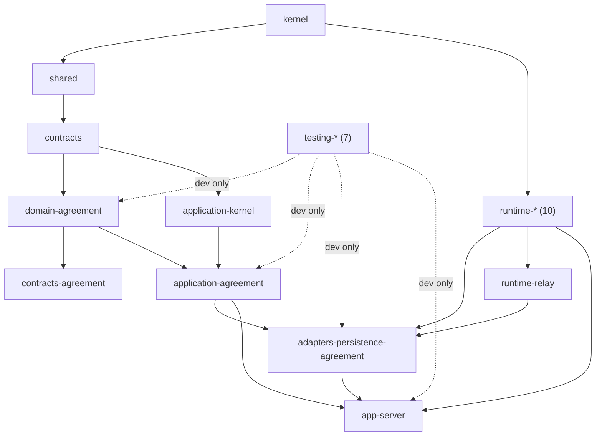

# Foundation Freeze Report

**MentoraOS — FOUNDATION FREEZE v1.0 — Rapport d'audit de stabilisation pré-R5**

| | |
|---|---|
| **Version** | 1.0 |
| **Date d'audit** | 2026-08-17 |
| **Périmètre audité** | Dépôt entier au commit `999b32f` (arch-008-candidate) |
| **Méthode** | Audits outillés (scripts, gates exécutées, requêtes Git/DB réelles) + inspection ; AUCUN élément modifié |
| **Autorité** | La Constitution R2 prévaut ; ce rapport constate, il ne légifère pas |

---

## 1. Résumé exécutif

La Foundation de Mentora — Constitution matérialisée à 100 %, Runtime Foundation, canonicalisation RC-1→RC-6, persistance réelle, premier exécutable vivant, gouvernance d'organisation complète, gouvernance Git migrée — est **cohérente, prouvée et prête à être gelée**. L'audit outillé n'a trouvé **aucun marqueur expérimental** dans le code (0 FIXME/HACK/WIP ; l'unique « TODO » est un commentaire de conception délibéré du générateur DX), **aucun lien documentaire cassé** (1 373 liens relatifs vérifiés sur 202 fichiers), **aucune dépendance circulaire** (prouvé par la suite d'architecture exécutable), et **une seule micro-anomalie de dépendances** (une dépendance directe déclarée mais d'usage transitif seulement — sans effet).

L'audit a également produit sa découverte la plus précieuse **en direct** : la gate froide de gel a d'abord échoué, et l'instruction a révélé un **processus serveur zombie** (survivant d'un test de boot manuel, le `kill` Git-Bash n'ayant tué que son wrapper) dont le relais réclamait et publiait les lignes de la base de test sous les pieds des suites. Le zombie éliminé, la suite est redevenue stable et la gate a été rejouée à froid. Ce n'est pas un défaut du socle — c'est un défaut d'hygiène d'environnement de dev, désormais documenté avec sa parade (§12, R-1).

**Verdict proposé : GO** (justification complète dans Foundation Acceptance).

## 2. État général — les marqueurs expérimentaux

| Recherche | Résultat |
|---|---|
| `TODO` / `FIXME` / `HACK` / `XXX` / `WIP` / `@deprecated` / « temporaire » (code + config + SQL + prisma) | **1 occurrence** : `platform/turbo/generators/config.ts:7` — doc-comment décrivant les marqueurs `TODO(Phase 1)` que le générateur *produit à dessein* (squelettes citant le chapitre R2 propriétaire). Délibéré, conservé |
| Expérimentations / code mort évident | Aucun trouvé ; tous les paquets sont consommés par le graphe ou sont des feuilles déclarées (apps, tooling) |
| Doublons | Aucun doublon de responsabilité détecté (chaque paquet a une mission unique — Inventory §2) |
| Barrels incorrects | **0** — le défaut historique (contract suites important vitest dans les barrels de production) a été corrigé au lot 2B-3 (sous-chemins `/contract-suite`) et vérifié par le boot réel |
| Références mortes | 0 lien Markdown cassé ; 0 référence tsconfig morte (le build du graphe passe) |
| Imports circulaires | **0** — prouvé par `@mentora/testing-architecture` (« has no runtime dependency cycles », exécuté dans la gate) |
| Dépendances inversées / violations de couches | **0** — prouvé par les tests de ring layering (I-1) et « no package depends on an app » (apps = feuilles) |

## 3. Architecture

- Le graphe des paquets est un **DAG prouvé**, les familles ADR-0003 sont respectées, les apps sont des feuilles — tout cela est *exécutable* (la suite d'architecture tourne dans chaque gate, pas dans un wiki).
- Les trois Séquences, les trois canaux, les dispatchers fermés, la rétention atomique ordonnée, le relais par sujet : implémentés conformes aux chapitres propriétaires, chacun tracé dans son rapport de lot.
- Une classification volontairement « non classée » subsiste : `runtime-*` et `adapters-persistence-agreement` ne matchent pas les préfixes stricts (`@mentora/adapter-`) de `layerOf` — tolérance héritée des lots gelés, candidate à resserrement (R5, non bloquant).

## 4. Qualité (preuves exécutées pendant cet audit)

| Preuve | Résultat |
|---|---|
| Gate froide complète (0 cache), base PostgreSQL réelle | **112/112 tâches, 0 erreur, 0 warning** (7 min 03, rejouée après élimination du zombie ; détail §12 R-1) |
| Suite adapters seule, rejouée 2× post-correction d'environnement | 34/34, puis 34/34 (stable) |
| Couvertures des lots récents (rapports de lot, seuil ≥95/95/95) | 2B-1 : 98,49/96,89/100 · 2B-2 : 100/95,41/100 · 2B-3 : 100/96,87/100 |
| Boot réel | Prouvé au lot 2B-3 : processus vivant, 200 sur /live /ready /health, mort sur demande |
| Contract suites | Relais : référence mémoire + implémentation SQL rejouent LA MÊME suite ; persistance : idem |

## 5. Documentation — matrice de cohérence

| Couche | Document(s) | Autorité | Cohérence vérifiée avec | Verdict |
|---|---|---|---|---|
| Loi | `docs/canon/` (27 chapitres + projections + publication) | Constitutionnelle (Titre VII) | — (souveraine) | ✅ complète, 0 lien cassé |
| Ingénierie de plateforme | ADR 0001-0003 + engineering 01-13 (Blueprint, RC-1..6) | Architecture Office | Canon (citations d'articles) | ✅ aucune contradiction relevée |
| Organisation | Organization · Career Ladder · Handbook | CTO | Canon + entre eux (Handbook cite les deux autres ; préséance déclarée dans chacun) | ✅ hiérarchie explicite |
| Gel | Les 4 documents du présent Freeze | CTO | Tout ce qui précède | ✅ (ce rapport) |
| Héritage | `docs/architecture/` (design system Flutter), `baseline/`, `philosophy/` | Historique, non-normatif | N'entre pas en conflit : il PRÉCÈDE le canon | ⚠ versement en `history/` = dette documentaire connue, non bloquante |

Sections orphelines : aucune (l'INDEX du canon référence ses chapitres ; les READMEs de familles pointent leurs enfants ; 0 lien cassé). Doublons : aucun — chaque règle a un propriétaire unique et les documents avals citent au lieu de redéfinir (règle CTO n°8).

## 6. Git

| Point | État |
|---|---|
| Remote | `origin` → `https://github.com/MentoraOS/mentora.git` ✅ |
| Branches distantes | `main` = `develop` = `release` = `arch-008-candidate` = `383a6a1` ✅ |
| Branche locale | `arch-008-candidate` à `999b32f` — **ahead 3** (les commits de gouvernance Phase 3.x, en attente d'ordre de poussée) |
| Tag | `foundation-v1.0.0` → `8d095ee`, local ET distant, intact ✅ |
| Historique | **51 commits** linéaires depuis la baseline ; aucun merge parasite, aucune réécriture ; convention genèse respectée sur toute la chaîne |
| Branches orphelines | Aucune (4 branches, toutes nommées et gouvernées ; Genesis préservée) |
| Divergence | Aucune hormis l'« ahead 3 » volontaire ci-dessus |
| ⚠ Pendants | Branche par défaut GitHub encore `arch-008-candidate` ; aucune protection/Ruleset/CODEOWNERS (phase GitHub Governance ordonnée mais non exécutée) |

## 7. Monorepo (configs)

| Élément | Verdict |
|---|---|
| `pnpm-workspace.yaml` | ✅ 32 projets, `hoist=false`, allowlist de build scripts explicite (supply chain) |
| `tsconfig.json` racine | ✅ 27 références build = tous les paquets buildables + app ; le build du graphe passe |
| `turbo.json` | ✅ strict-env + `globalPassThroughEnv` déclaré ; sérialisation `app-server#test → adapters#test` déclarée (base partagée) |
| eslint / prettier / vitest presets | ✅ centralisés dans tooling/ et testing-config ; « CI-identique » |
| Prisma | ✅ épinglé majeur 6 (6.19.3), migrations 0001+0002 expand-only (S-7), déployées et vérifiées |
| Docker | ⚠ conteneur de dev manuel (`mentora-pg-2b1`) ; pas de compose file — candidat R5 (enregistré, non bloquant) |

## 8. Runtime

Les dix paquets `runtime-*` sont gelés et TOUS consommés par l'exécutable réel. Le cycle 9 états, le boot fail-closed à rapport complet, le drainage inverse, les surfaces R-6 : prouvés par 20 tests + le processus réel. Le mixte Application+Relay reste **toléré-dev** (F5.1 §3) — la scission des espèces appartient à R8 (roadmap) ; signalé, conforme.

## 9. Tests

452+ tests workspace au dernier comptage de lot, dont : suites d'architecture exécutables, contract suites rejouées sur infrastructure réelle, boucle e2e complète, boot/shutdown/signaux. Politique : ≥95/95/95 par paquet, gate froide comme référence, un bug clos = un test de non-régression. **Découverte de cet audit** : la stabilité des suites DB dépend de l'hygiène des processus (§12 R-1) — la parade est documentée.

## 10. Sécurité

| Point | État |
|---|---|
| Secrets en dépôt | **0** (URL de dev vers conteneur jetable uniquement, jamais commitée en fichier ; discipline `SecretReference` I-8 posée, vault = R8) |
| Supply chain | Lockfile commité ; build scripts en allowlist ; versions épinglées ; preuve d'artefact au boot = loi F5.1 (outillage à venir) |
| Auth/droits | Session au gateway / droits au dispatch (M-10) : architecture posée, implémentation I&A = R5+ |
| Données | S-9 respecté : bases de test = données de spec uniquement ; télémétrie sans matière ni SessionId |

## 11. Observabilité

Log structuré déterministe, métriques, tracing (traceparent porté intact), santé trois-surfaces : câblés et prouvés. Puits réels (exporteurs, alerting) : signalés, R5+/R9. Journal probant : transite par le puits de log (O-10, interchangeable) — le store durable est une dette signalée depuis 2B-3, portée à la roadmap.

## 12. Risques (matrice)

| # | Risque | Prob. | Impact | Parade |
|---|---|---|---|---|
| R-1 | **Processus zombie sur la base de test partagée** (vécu pendant cet audit : serveur leaké → suites DB flaky ; cause aggravante : `kill` Git-Bash sous Windows ne tue que le wrapper) | Moyenne | Moyen (faux rouges, temps perdu) | Documenté ici ; réflexe : `Get-Process node` avant toute session de gate ; R5 : compose + bases séparées dev/test ; leçon candidate au catalogue Handbook |
| R-2 | Protections GitHub absentes (push direct possible sur les 4 branches) | Haute tant que non configuré | Haut | Phase GitHub Governance = prochaine opération ordonnable ; ne pas ouvrir R5 en équipe élargie avant |
| R-3 | Branche par défaut GitHub ≠ `main` | Certaine (constatée) | Faible-moyen (Rulesets viseraient mal) | `gh repo edit --default-branch main` après authentification |
| R-4 | Commits de gouvernance non poussés (ahead 3) | Certaine | Faible (perte locale possible) | Poussée sur ordre + propagation aux branches officielles |
| R-5 | Windows : SIGTERM externe non délivrable aux handlers Node | Certaine sur cette plateforme | Faible (prouvé par SignalHost injecté) | Re-prouver le drainage sur la plateforme de production (Linux) en R8 |
| R-6 | Exits transitoires du runner turbo sous Windows (3 occurrences historiques) | Faible | Faible (re-run propre) | Documenté ; surveiller ; jamais masqué |
| R-7 | Pendants Titre VII (corrélation dans le port de rétention ; projections ; NoShowSettlementProcess ; raisons de refus de lecture) | — | Moyen si R5 les rencontre sans instruction | Listés dans la roadmap ; instruction AVANT le lot concerné, jamais d'improvisation |
| R-8 | Dépendance directe `domain-agreement` déclarée par `app-server` sans import direct | Certaine (constatée) | Négligeable | Micro-nettoyage au premier lot R5 touchant app-server (le gel n'autorise aucune retouche) |

## 13. Actions recommandées avant R5

1. **Pousser** les 3 commits de gouvernance + ce gel, et propager `main`/`develop`/`release` (ordre CTO).
2. **Exécuter la phase GitHub Governance** : branche par défaut → `main`, protections, Rulesets, CODEOWNERS (l'Ownership Matrix est prête), environnements.
3. **Ratifier la roadmap** R5 (contenu ordonné) et le statut proposé de R6→R10.
4. **Instruire les pendants Titre VII** que le premier lot R5 rencontrera (au minimum : transport de la corrélation si la surface d'entrée doit la propager de bout en bout).
5. Outillage d'hygiène dev (compose, bases séparées) — premier lot technique de R5, avec le micro-nettoyage R-8.

---

*Rapport établi sans modifier aucune Foundation, aucun paquet, aucun document existant. Les quatre documents du gel sont les seuls ajouts.*
