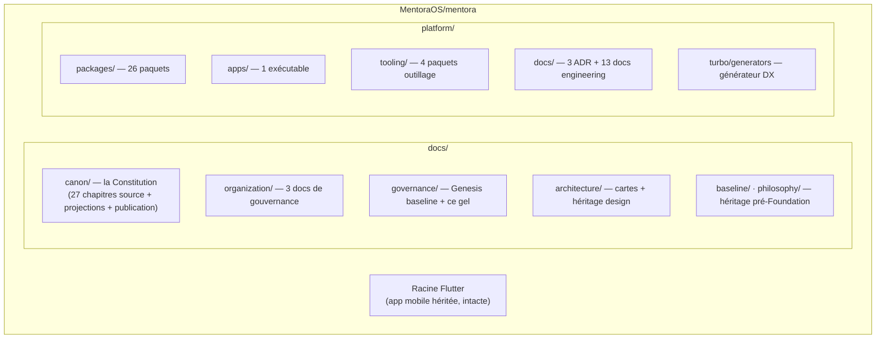

# Foundation Inventory

**MentoraOS — FOUNDATION FREEZE v1.0 — Inventaire exhaustif du socle**

| | |
|---|---|
| **Version** | 1.0 |
| **Date de relevé** | 2026-08-17, commit `999b32f` (arch-008-candidate) |
| **Méthode** | Relevé outillé (scripts d'audit) + inspection ; aucun élément modifié |

---

## 1. Le monorepo en un regard

**Compteurs de relevé** : 31 paquets workspace (+1 racine) · 202 fichiers Markdown · 1 373 liens relatifs internes (0 cassé) · 51 commits depuis la baseline `8d095ee` · 1 tag (`foundation-v1.0.0`) · 4 branches.

---

## 2. Packages — les 26 de `platform/packages/`

| Paquet | Famille (ADR-0003) | Rôle | Statut |
|---|---|---|---|
| `@mentora/kernel` | kernel | Result, invariants, primitives — dépend de RIEN | Gelé |
| `@mentora/shared` | shared | Types partagés (Logger…) | Gelé |
| `@mentora/contracts` | contracts | Enveloppes, ActorRef, socle des contrats | Gelé |
| `@mentora/contracts-agreement` | contracts | Contrats wire du domaine Engagement | Gelé |
| `@mentora/domain-agreement` | domain | L'unité `Agreement` : machine d'états, actes, Refus | Gelé |
| `@mentora/application-kernel` | application | LES trois Séquences + trois dispatchers + builders + journaux | Gelé |
| `@mentora/application-agreement` | application | 8 services de commande + query side + `composeAgreement` | Gelé |
| `@mentora/runtime-clock` | runtime | SystemClock — la SEULE horloge licite | Gelé (Foundation) |
| `@mentora/runtime-identity` | runtime | UuidFactory (CSPRNG) | Gelé (Foundation) |
| `@mentora/runtime-config` | runtime | Le SEUL lecteur d'environnement ; fail closed listes complètes | Gelé (Foundation) |
| `@mentora/runtime-logging` | runtime | Log structuré déterministe (clés triées) | Gelé (Foundation) |
| `@mentora/runtime-metrics` | runtime | MetricsSink/Registry | Gelé (Foundation) |
| `@mentora/runtime-tracing` | runtime | TraceId/SpanId, traceparent W3C | Gelé (Foundation) |
| `@mentora/runtime-health` | runtime | HealthRegistry, probes R-6 | Gelé (Foundation) |
| `@mentora/runtime-serialization` | runtime | canonicalJson, VersionedPayload, FNV-1a | Gelé (Foundation) |
| `@mentora/runtime-security` | runtime | SecretReference (discipline nom-seul I-8) | Gelé (Foundation) |
| `@mentora/runtime-bootstrap` | runtime | RuntimeBuilder/Container — cycle 9 états | Gelé (Foundation) |
| `@mentora/runtime-relay` | runtime | Le moteur générique de relais d'Outbox (2B-2) | Gelé |
| `@mentora/adapters-persistence-agreement` | adapters | Registre PostgreSQL/Prisma + source relais SQL (2B-1/2B-3) | Gelé |
| `@mentora/testing` | testing | Matchers, socle de test | Stable |
| `@mentora/testing-config` | testing | Preset vitest commun (« CI-identique ») | Stable |
| `@mentora/testing-clock` | testing | Horloge de test | Stable |
| `@mentora/testing-id` | testing | Identités de test | Stable |
| `@mentora/testing-contracts` | testing | Socle contract-suites | Stable |
| `@mentora/testing-performance` | testing | Socle budgets de perf | Stable |
| `@mentora/testing-architecture` | testing | Les lois exécutables : DAG, familles, scope, apps-feuilles | Stable |

## 3. Apps & tooling

| Élément | Chemin | Rôle |
|---|---|---|
| `@mentora/app-server` | `platform/apps/server` | LE premier exécutable vivant (2B-3) : Root réel, boot 9 états, /live /ready /health, boucle commande→rétention→relais prouvée sur PostgreSQL réel |
| `@mentora/eslint-config` | `platform/tooling/eslint-config` | La loi lint commune (flat config) |
| `@mentora/eslint-plugin-mentora` | `platform/tooling/eslint-plugin-mentora` | Les règles MENTORA00xx (vocabulaire réservé, naming) |
| `@mentora/prettier-config` | `platform/tooling/prettier-config` | Format commun |
| `@mentora/tsconfig` | `platform/tooling/tsconfig` | Les bases two-tsconfig (IDE + build) |
| Générateurs | `platform/turbo/generators` | `turbo gen` : squelettes conformes (naming + wiring), jamais de logique métier |

## 4. La Constitution matérialisée (`docs/canon/`)

| Titre | Chapitres | État |
|---|---|---|
| **Foundation (F1)** | 1 (transcription byte-identique du texte ratifié) | ✅ 100 % |
| **Constitution (F2)** | 6 — landscape (15 domaines), context map, langage/responsabilités/contrats, dictionnaire bilingue, règles/invariants/failure modes, Architecture Constitution (P1-P18, 9 Titres) | ✅ 100 % |
| **Domain (F3)** | 6 — building blocks, 3 chapitres d'agrégats (30 unités), grand audit (R-C), gel documentaire | ✅ 100 % |
| **Application (F4)** | 5 — Séquence de commande, Process Managers, Circulation, Infrastructure/Composition/Runtime, grand audit | ✅ 100 % |
| **Production (F5)** | 9 — runtime, persistance, observabilité, sécurité, fiabilité, scalabilité, opérations, gouvernance, grand audit | ✅ 100 % |
| **Projections** | Catalogues (events 73, commands 79, queries 11, policies 16, aggregates 30, projections, identités, machines d'états, lois, théorèmes, chaînes de preuve) + glossaire + handbook | ✅ |
| **Publication** | Books (6) + Production Closure (certificats, PCR) + manifest final | ✅ |
| **Décisions** | `decisions/adr/`, `decisions/rfc/` (structure prête, registres ouverts) | ✅ structure |
| **Appareil** | README, MANIFEST, CONVENTIONS, VERSIONING, PUBLICATION, GOVERNANCE (principe R2-Corpus #6), INDEX, NAVIGATION, templates (11) | ✅ |

## 5. Documents d'ingénierie (`platform/docs/`)

| Série | Contenu |
|---|---|
| ADR 0001-0003 | Monorepo foundation · Repository strategy · Package classification (la loi des familles, prouvée par `testing-architecture`) |
| Engineering 01-05 | Architecture, conventions, build/versioning, roadmap, testing strategy |
| Engineering 06 | Persistence Adapters Blueprint (2A-2) |
| Engineering 07-12 | RC-1 Canonical Persistence Model · RC-2 Error Catalog · RC-3 Observability · RC-4 Naming · RC-5 Adapter Guidelines · RC cross-audit |
| Engineering 13 | RC-6 Runtime Decision Matrix — « que fait la plateforme quand X » (10 matrices) |

## 6. Gouvernance d'organisation (`docs/organization/`)

| Document | Version | Commit | Rôle |
|---|---|---|---|
| Engineering Organization | 1.0 | `1847ae3` | Sièges, 15 équipes-domaines, matrices interaction/ownership, scaling 2→300 |
| Engineering Career Ladder | 1.0 | `15911c2` | 8 niveaux, Decision Authority Matrix, review ladder, promotion framework |
| Engineering Handbook | 1.0 | `999b32f` | Le quotidien : cycle de dev, git workflow, PR/review/ADR/RFC/incident/release, FAQ 52, anti-patterns 52 |

## 7. Héritage pré-Foundation (identifié, intact)

`docs/architecture/` (cartes modules + ~30 docs design-system de l'ère Flutter), `docs/baseline/`, `docs/philosophy/`, `docs/governance/GENESIS_BASELINE.md`, et la racine Flutter (`lib/`, `android/`, `ios/`…). **Statut** : héritage historique non-normatif ; le versement organisé dans `canon/appendices/history/` est une dette documentaire enregistrée de longue date (non bloquante — l'héritage ne contredit pas le canon, il le précède).

## 8. Infrastructure de développement

| Élément | État |
|---|---|
| PostgreSQL de test | Conteneur Docker `mentora-pg-2b1` (pgvector/pg16, port 5433), base `mentora_agreement_test`, jetable ; migrations `0001_init` + `0002_relay_claims` déployées |
| Prisma | Épinglé majeur 6 (6.19.3) — décision délibérée (v7 a changé son modèle de config) |
| pnpm | Workspace 32 projets, `hoist=false`, `onlyBuiltDependencies` en allowlist |
| turbo | Pipeline typecheck/lint/test/build ; strict env avec `globalPassThroughEnv` ; sérialisation déclarée app-server#test → adapters#test |
| Compose file | ABSENT (le conteneur se lance à la main) — candidat d'outillage R5, enregistré |

---

*Relevé établi sans modification d'aucun élément. Toute divergence future entre cet inventaire et le dépôt se corrige par nouvelle édition de l'inventaire — jamais l'inverse.*
