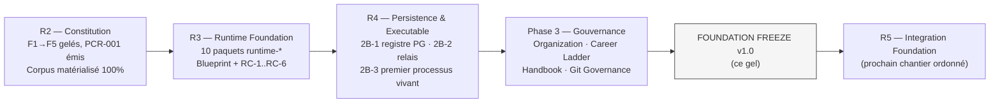
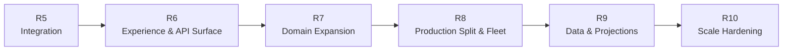

# Foundation Roadmap

**MentoraOS — FOUNDATION FREEZE v1.0 — Ce qui est fait, ce qui est gelé, ce qui vient**

| | |
|---|---|
| **Version** | 1.0 |
| **Règle** | R5 est ordonné par le CTO ; R6→R10 sont une TRAJECTOIRE PROPOSÉE, à ratifier génération par génération. Rien ici ne crée de loi ; les frontières restent celles du canon. |

---

## 1. Ce qui est TERMINÉ et GELÉ

| Génération | Contenu | Preuve de clôture |
|---|---|---|
| **R2 — Constitution** | F1→F5 gelés (Titre VII seule voie), 15 domaines, 18 lois, 30 unités, 73 events, 79 commandes ; PCR-001 signé & émis ; Corpus canonique matérialisé à 100 % (27 chapitres + projections + publication) | Tag `foundation-v1.0.0` = `8d095ee` ; grand audit F5.99 (12 procès tenus) |
| **R3 — Runtime Foundation** | Les 10 paquets `runtime-*` ; Blueprint persistance ; canonicalisation RC-1→RC-6 (modèle persistance, catalogue d'erreurs, observabilité, naming, guidelines adapters, matrice de décision) | Commits `94a47c8`→`adbb5de` ; gates vertes ; « Runtime Foundation CLOSE » |
| **R4 — Persistence & Executable** | 2B-1 registre PostgreSQL/Prisma (clé R-A EXCLUDE, rétention sérialisable) ; 2B-2 moteur de relais générique ; 2B-3 premier exécutable vivant (Root réel, boot 9 états, boucle e2e complète) | Commits `424e452`, `5d747ae`, `383a6a1` ; gate froide 112/112 ; processus réel booté/sondé/éteint |
| **Phase 3 — Gouvernance** | Engineering Organization, Career Ladder, Handbook ; migration MentoraOS ; branches main/develop/release ; tag publié | Commits `1847ae3`, `15911c2`, `999b32f` ; branches distantes alignées |

**Le gel** : tout ce qui précède est **figé**. Modifications désormais possibles uniquement par : défaut avéré (ADR + review Principal-équivalent + ratification CTO), ou amendement Titre VII pour le canon. Aucun élément expérimental ne reste en circulation (audit : Freeze Report §2).

---

## 2. R5 — Integration Foundation (ORDONNÉ, prochain)

Le chantier qui fait sortir les faits de leur domaine et entrer les intentions du monde réel — sans jamais toucher au gelé :

| Lot candidat | Contenu | Fondations qui l'attendent déjà |
|---|---|---|
| Surface d'entrée des commandes | La porte HTTP/BFF réelle vers `CommandDispatch`/`QueryDispatch` (driving adapters, I-12) | Le 404 du HttpServerModule réserve la place ; dispatchers fail-closed prêts |
| Broker adapter | La première implémentation réelle de `RelayPublisherPort` le jour de la PREMIÈRE souscription déclarée (M-5) | `EmptyRoutingPublisher` documente exactement son remplacement ; le relais ne changera pas |
| Inbox de consommation | Le côté consommateur réel (dédup A-5) pour la première Réaction câblée | `ReactionDispatch` + Inbox schema prêts |
| Identité & session à l'entrée | Vérification de session au gateway (M-10) — le minimum pour une entrée authentifiée | `ActorRef` injecté partout ; I&A domaine à naître |
| Outillage d'intégration | docker-compose de dev ; harnais d'intégration multi-processus | Conteneur manuel documenté |

**Pendants Titre VII que R5 va rencontrer** (à instruire, jamais improviser) : transport de la corrélation dans le port de rétention (aujourd'hui NULL à l'écriture — le port gelé ne la transporte pas) ; raisons de refus de lecture ; définition de NoShowSettlementProcess si une Réaction réelle le réclame.

---

## 3. Trajectoire PROPOSÉE — R6 → R10 *(à ratifier génération par génération)*

| Génération | Proposition de contenu | Ce qu'elle NE fera pas |
|---|---|---|
| **R6 — Experience & API Surface** | Le contrat public complet de l'Application (API versionnée par générations V-1..V-6), BFF web/mobile, premières surfaces front consommant les vraies queries | Ne crée aucun domaine ; ne déforme aucun contrat ratifié |
| **R7 — Domain Expansion** | Deuxième puis troisième domaine implémentés (candidats naturels : Account, I&A, Discovery) selon le même rituel que l'Agreement ; premier Process Manager réel (exige l'instruction Titre VII de NoShowSettlementProcess) | N'invente pas de PM non ratifié ; une équipe-domaine à la fois |
| **R8 — Production Split & Fleet** | Scission des espèces d'exécutables (Application / Relay séparés — la tolérance dev F5.1 §3 prend fin), la Flotte (placement/remplacement), environnements staging/prod réels, vault (I-8 acquitté) | Ne change pas le domaine ; topologie = mécanisme |
| **R9 — Data & Projections** | Les projections ratifiées par le Titre VII pendant (owners/sources), l'entrepôt décisionnel (rebuildable), puits d'observabilité réels | Aucune projection sans ratification ; jamais une vérité dans l'entrepôt |
| **R10 — Scale Hardening** | Multi-région, budgets de charge, chaos drills, durcissement supply chain | Rien qui contredise « rollback binaires jamais les faits » |

**Loi de trajectoire** : chaque génération s'ouvre par son propre gel de la précédente (le rituel de CE document), et aucune ne modifie les frontières constitutionnelles — l'expansion remplit la carte, elle ne la redessine pas.

---

## 4. Heatmap de progression

| Capacité | R2 | R3 | R4 | Aujourd'hui | Après R5 (visé) |
|---|---|---|---|---|---|
| Lois & vocabulaire | 🟩 | 🟩 | 🟩 | 🟩 gelé | 🟩 |
| Machinerie runtime | ⬜ | 🟩 | 🟩 | 🟩 gelé | 🟩 |
| Persistance réelle | ⬜ | 🟨 blueprint | 🟩 | 🟩 gelé | 🟩 |
| Exécutable vivant | ⬜ | ⬜ | 🟩 | 🟩 gelé | 🟩 |
| Entrée du monde réel (API) | ⬜ | ⬜ | 🟨 404 réservé | 🟨 | 🟩 |
| Sortie vers consommateurs (broker/Inbox) | ⬜ | ⬜ | 🟨 relais prêt, routage vide | 🟨 | 🟩 |
| Gouvernance d'équipe | ⬜ | ⬜ | ⬜ | 🟩 v1.0 | 🟩 |
| Gouvernance GitHub (protections) | ⬜ | ⬜ | ⬜ | 🟥 pendante | 🟩 requis |
| Domaines implémentés | 0 | 0 | 1/15 | 1/15 | 1/15 (R7 en étend) |

---

*Cette roadmap constate et propose ; elle ne légifère pas. R6→R10 n'engagent Mentora qu'à leur ratification respective.*
