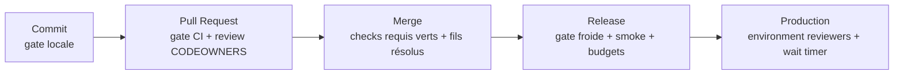
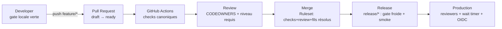

# GitHub Actions & CI/CD — Stratégie officielle

**MentoraOS — GitHub Governance v1.0, Lot 5 (MODE GENESIS)**

| | |
|---|---|
| **Version** | 1.0 |
| **Statut** | PLAN — **aucun workflow n'existe ni n'est prétendu exister** (§1) ; les créations réelles sont les premiers lots de R5 |
| **Loi maîtresse** | La CI **applique** les Foundations, elle ne les remplace jamais ; la gate CI = la gate locale, à l'identique (« CI-identique », preset gelé) |

---

## 1. Audit (état des lieux, plafond sans authentification)

| Vérification | Méthode | Résultat |
|---|---|---|
| Workflows / Actions dans le dépôt | scan (`.github/`) | **AUCUN** — `.github/` ne contient que CODEOWNERS ; `dependabot.yml` absent |
| Secrets / Variables / Rulesets / Required checks / Packages / Dependabot / CodeQL / Security settings / Actions autorisées / Permissions par défaut | API authentifiée requise | **INAUDITABLES** (`gh` non authentifié, `GH_TOKEN` absent) — l'audit authentifié est l'étape 0 du séquencement d'exécution (Lots 2→5) |
| La gate réelle d'aujourd'hui | exécutée localement | `pnpm verify` : 112/112 tâches à froid, 0 erreur, 0 warning (preuve du Foundation Freeze) — c'est ELLE que la CI reproduira à l'identique |

## 2. Philosophie CI/CD

**Pourquoi la CI existe** : pour que la gate ne dépende plus d'une machine ni d'une discipline individuelle — la preuve devient un fait d'infrastructure, opposable, horodaté, identique pour tous.

**Pourquoi elle ne remplace jamais les Foundations** : la CI ne définit RIEN. Les seuils (≥95/95/95), les suites, les lois d'architecture exécutables, les presets vivent dans le dépôt (testing-config, testing-architecture, tooling) — gelés. Une CI qui inventerait ses propres règles créerait une seconde vérité ; la nôtre exécute `pnpm verify`, point. Corollaire : **aucun comportement spécial CI** (le preset gelé l'interdit) — ce qui passe localement passe en CI, ce qui casse en CI casse localement.

**Les niveaux** :



## 3. Les workflows officiels (TOUS « planifiés » — aucun n'existe)

| Workflow | Fichier prévu | Déclencheur | Contenu | Publie les checks |
|---|---|---|---|---|
| **CI** | `ci.yml` | `pull_request`, `push` sur branches protégées | `pnpm verify` via turbo (typecheck, lint, test, build) ; PostgreSQL 16 en service container (image pgvector, base jetable, secret `development`) | `typecheck`, `lint`, `test`, `build` |
| **Nightly** | `nightly.yml` | cron quotidien | La GATE FROIDE : caches turbo purgés, 0 cache — la référence anti-dérive ; + détection de flakiness (2 runs) | informatif (issue auto si rouge) |
| **Release** | `release.yml` | push sur `release/*`, tag `v*` | gate froide + build des artefacts + smoke (boot réel, /health, extinction) + provenance/attestation | `release-gate` |
| **Dependency Update** | `dependabot.yml` (config) | hebdo | PR groupées par famille ; majors jamais auto-mergés (leçon Prisma 7) | — |
| **Security Scan** | `security.yml` | PR + cron | audit dépendances (`pnpm audit`) + secret scanning complémentaire | `security` |
| **CodeQL** | `codeql.yml` | PR + cron | analyse statique JS/TS | `codeql` |
| **Documentation** | `docs.yml` | PR touchant `docs/**` | vérification des liens (le script d'audit du Freeze, industrialisé) + gel du canon (toute modification de `docs/canon/**` sans label `titre-vii` = échec) | `documentation` |
| **Architecture Validation** | inclus dans CI | — | la suite `testing-architecture` tourne DÉJÀ dans `test` ; check séparé `architecture` si signal dédié voulu (décision au lot CI) | (`architecture`) |
| **Contract Validation** | inclus dans CI | — | contract suites (mémoire + PostgreSQL réel) DÉJÀ dans `test` ; check séparé `contracts` optionnel | (`contracts`) |
| **Coverage** | inclus dans CI (`--coverage`) | PR | seuils ≥95/95/95 par paquet — échec = merge bloqué | `coverage` |

Esquisse documentée du cœur (`ci.yml`, à créer au premier lot R5 — ceci est un PLAN, pas un fichier) :

```yaml
# PLAN — .github/workflows/ci.yml (naîtra au lot CI de R5)
name: ci
on: { pull_request: {}, push: { branches: [main, develop, release, 'release/**'] } }
permissions: { contents: read }          # moindre privilège par défaut
concurrency: { group: ci-${{ github.ref }}, cancel-in-progress: true }
jobs:
  verify:
    runs-on: ubuntu-latest
    services:
      postgres:                           # la base jetable de la gate — parité avec le dev local
        image: pgvector/pgvector:pg16     # épinglée par digest à la création réelle
        env: { POSTGRES_USER: mentora, POSTGRES_PASSWORD: '***(secret env development)', POSTGRES_DB: mentora_agreement_test }
    steps:
      - checkout @SHA-épinglé
      - setup pnpm/node (versions du repo: .nvmrc, packageManager) @SHA-épinglé
      - pnpm install --frozen-lockfile
      - prisma migrate deploy (base de service)
      - pnpm verify        # LA gate — identique au poste de dev
      - coverage par paquet (vitest --coverage, seuils gelés)
```

## 4. Les Gates

| Gate | Objectif | Déclencheur | Entrées | Sorties | Bloque |
|---|---|---|---|---|---|
| **Commit Gate** | Ne jamais pousser du rouge | discipline locale (Handbook §3.8) + hooks locaux (DX) | l'arbre de travail | `pnpm verify` vert local | soi-même — pousser du rouge fait perdre le temps du réviseur |
| **PR Gate** | La preuve d'infrastructure | ouverture/synchronisation de PR | la branche | checks CI publiés | la review ne DEVRAIT pas commencer sur du rouge |
| **Merge Gate** | Rien de non prouvé n'entre dans une branche protégée | clic merge | checks requis + review CODEOWNERS + fils résolus | merge autorisé | TOUT — c'est le verrou des Rulesets (Lot 3) |
| **Release Gate** | Le train ne part que complet | coupe/évolution de `release/*` | gate froide + smoke + budgets perf | artefact + tag candidat | la release |
| **Deployment Gate** | L'humain avant la production | déploiement vers `production` | reviewers d'environment + wait timer 10 min (Lot 4) | déploiement | la production |

## 5. Required Status Checks — liste officielle

**Actifs aujourd'hui : AUCUN** (aucun workflow n'existe — les exiger bloquerait toute PR ; décision du Lot 3, maintenue).

| Check | Naissance | Devient requis |
|---|---|---|
| `typecheck`, `lint`, `test`, `build` | **Future R5** (premier lot CI) | immédiatement à leur naissance (une commande sur les 3 Rulesets) |
| `coverage` | **Future R5** (même lot, `--coverage`) | avec les précédents |
| `architecture`, `contracts` | **Future R5** — déjà DANS `test` ; checks séparés si signal dédié | optionnel (décision au lot CI) |
| `documentation` | **Future R5** (lien-checker + gel du canon) | requis sur les PR touchant `docs/**` |
| `security` (audit dépendances), `codeql` | **Future R6** (outillage par ADR) | R6 |
| `dependency audit` | **Future R6** (Dependabot + audit en CI) | R6 |
| `container scan` | **Future R8** (les images naissent au split des espèces/Fleet) | R8 |

## 6. Supply Chain Security

| Mesure | Politique | Quand |
|---|---|---|
| **Actions épinglées par SHA** | TOUTE action tierce est référencée par SHA complet (jamais par tag mobile) — le pendant CI de l'allowlist pnpm gelée | dès le premier workflow |
| **Permissions minimales** | `permissions: contents: read` par défaut au niveau workflow ; élévations par job, justifiées en commentaire | dès le premier workflow |
| **Politique des actions tierces** | Allowlist GitHub (Settings→Actions) : actions GitHub officielles + liste nommée approuvée par `platform`+`security` ; toute addition = PR sur ce document | à l'exécution des lots |
| **`pull_request_target`** | INTERDIT sans revue `security` explicite (vecteur classique d'exfiltration) | permanent |
| **Dependabot** | Config au lot R5-CI : hebdo, groupé, majors en revue humaine obligatoire | R5 |
| **CodeQL** | Workflow R6 (ADR outillage sécurité) | R6 |
| **Secret Scanning + Push Protection** | À ACTIVER dans les settings dès l'exécution authentifiée (commande fournie §10) — le filet sous la discipline I-8 | exécution des lots |
| **SBOM** | Génération à chaque release (`release.yml`) — l'inventaire de ce qui compose l'artefact | R5 (release) |
| **Provenance / Artifact Attestation** | Attestation de build à chaque artefact de release — matérialise la « preuve d'artefact au boot » (F5.1 : intégrité/signature/provenance) | R5 (release), consommée au boot à R8 |
| **OIDC** | Fédération obligatoire au premier déploiement cloud (Lot 4 §5) — aucun secret cloud statique | R8 |

## 7. Pipeline Strategy — les points de contrôle



Contrôles : (1) gate locale (discipline) ; (2) checks CI (infrastructure) ; (3) review humaine routée par CODEOWNERS (jamais remplacée par la CI) ; (4) verrou de merge (Rulesets) ; (5) release gate (froide) ; (6) deployment gate (humain + timer). **Aucun point de contrôle n'est optionnel ; aucun ne se contourne sans bypass tracé (Lot 3 §7).**

## 8. Failure Policy

| Échec | Conduite | Qui décide / documente / relance |
|---|---|---|
| `typecheck` / `lint` / `build` rouges | L'auteur corrige — jamais de merge « en attendant » | l'auteur ; trace = la PR elle-même |
| Tests rouges | Défaut réel → fix + test ; test flaky → LE TEST est le bug (jamais de retry-masquage, anti-pattern #42) | l'auteur ; le Senior du domaine arbitre si litige |
| Coverage insuffisante | On écrit les tests — jamais baisser un seuil (anti-pattern #41) | l'auteur ; exception de seuil = décision CTO écrite |
| Workflow indisponible (bug du yml) | Fix du workflow par `platform` en PR prioritaire ; PAS de bypass de checks pendant ce temps sauf urgence tracée | `platform` décide, documente (issue), relance |
| Runner indisponible | Re-run (transitoire) ; si persistant : incident infra `platform` ; la règle des exits transitoires Windows s'applique : JAMAIS masquer, toujours documenter | `platform` |
| GitHub indisponible | On attend — la gate locale reste la preuve de travail ; AUCUN merge manuel hors process ; si urgence de production réelle : bypass org admin TRACÉ (Lot 3 §7) | CTO seul |

**Règle commune** : tout échec répété (2+ occurrences d'une même cause infra) devient une issue nommée avec propriétaire — les échecs sont des données, pas du bruit.

## 9. Observabilité de la CI

**Logs** : rétention GitHub 90 jours par défaut — les verdicts qui comptent (releases) sont archivés en artefacts. **Artifacts** : rapports de couverture (LCOV) et SBOM conservés 30 jours ; artefacts de release conservés attachés à la release (permanents). **Notifications** : échec sur branche protégée → notification équipe propriétaire ; Nightly rouge → issue automatique assignée `platform`. **Historique/Audit** : l'onglet Actions est l'historique probant des gates ; les bypass vivent dans les issues tracées ; l'audit trimestriel (Handbook §16) inclut la revue des runs rouges récurrents.

## 10. Futures Foundations — plan de création réel

| Foundation | Workflows créés | Checks devenant requis | Environnements consommés |
|---|---|---|---|
| **R5** | `ci.yml`, `nightly.yml`, `docs.yml`, `dependabot.yml`, `release.yml` (squelette) | `typecheck`, `lint`, `test`, `build`, `coverage`, `documentation` | `development` |
| **R6** | `security.yml`, `codeql.yml`, deploy des surfaces | `security`, `codeql`, `dependency audit` | `staging` (previews) |
| **R7** | évals IA en CI (gateway) | évals comme checks des paquets `ai-*` | inchangés |
| **R8** | déploiements OIDC, `container scan`, attestation consommée au boot | `container-scan` | `production` (réel) |
| **R9** | pipelines data (qualité de données en CI) | checks data | entrepôt |

Commandes d'activation à conserver (post-création des workflows R5) :

```bash
# Activer les checks requis sur les 3 Rulesets (ids via: gh api repos/MentoraOS/mentora/rulesets)
gh api -X PUT repos/MentoraOS/mentora/rulesets/<ID_MAIN> --input rulesets/main-with-checks.json
# Secret scanning + push protection (dès l'exécution authentifiée, avant même R5):
gh api -X PATCH repos/MentoraOS/mentora -f security_and_analysis[secret_scanning][status]=enabled \
  -f security_and_analysis[secret_scanning_push_protection][status]=enabled
```

## 11. CI/CD Maturity Model

| Niveau | Définition | Mentora |
|---|---|---|
| **0 — Manuel** | Preuve sur le poste du développeur uniquement | **AUJOURD'HUI** — assumé et documenté : gate locale 112/112, zéro workflow ; la discipline tient lieu d'infrastructure |
| **1 — CI de base** | La gate tourne sur chaque PR, checks requis | **R5** (premier lot CI : `ci.yml` + activation des checks) |
| **2 — CI complète** | Nightly froide, docs, dependabot, release gate, SBOM | **R5 fin** |
| **3 — Sécurité intégrée** | CodeQL, audit dépendances, secret scanning actif, checks sécurité requis | **R6** |
| **4 — CD gouverné** | Déploiements staging/production par environments, OIDC, attestation consommée au boot, container scan | **R8** |
| **5 — Auto-observée** | La chaîne se mesure elle-même (flakiness, durées, coûts), data pipelines en CI, chaos drills programmés | **R9/R10** |

## 12. Pipeline Ownership

| Workflow | Équipe propriétaire | Foundation propriétaire | Mainteneur | Politique d'évolution |
|---|---|---|---|---|
| `ci.yml` | `platform` | R5 | siège CI/CD (CTO à la genèse) | Toute modification = PR reviewée `platform` ; ajout d'un check requis = décision CTO (il change le verrou de merge) |
| `nightly.yml` | `platform` + `qa` | R5 | siège CI/CD | idem |
| `docs.yml` | `docs` + `architecture` | R5 | Documentation Team | le gel du canon dans ce workflow ne se désactive que par Titre VII |
| `dependabot.yml` | `platform` + `security` | R5 | siège CI/CD | majors toujours en revue humaine |
| `release.yml` | `platform` | R5 | Release Engineering | évolution = ADR si elle change la définition du train |
| `security.yml` / `codeql.yml` | `security` | R6 | Security | seuils d'échec = décision security, appel CTO |
| déploiements (R8) | `platform` + `security` | R8 | Release Engineering | OIDC non négociable |

Règle commune : un workflow sans propriétaire déclaré ici ne peut pas être créé (le pendant CI de l'anti-pattern #22 « paquet sans ownership »).

---

*Aucun workflow, aucune action, aucun check n'existe du fait de ce lot et aucun n'est prétendu exister. Ce document est la loi de leur naissance : R5 les créera exactement comme décrits, ou amendera ce document d'abord.*
