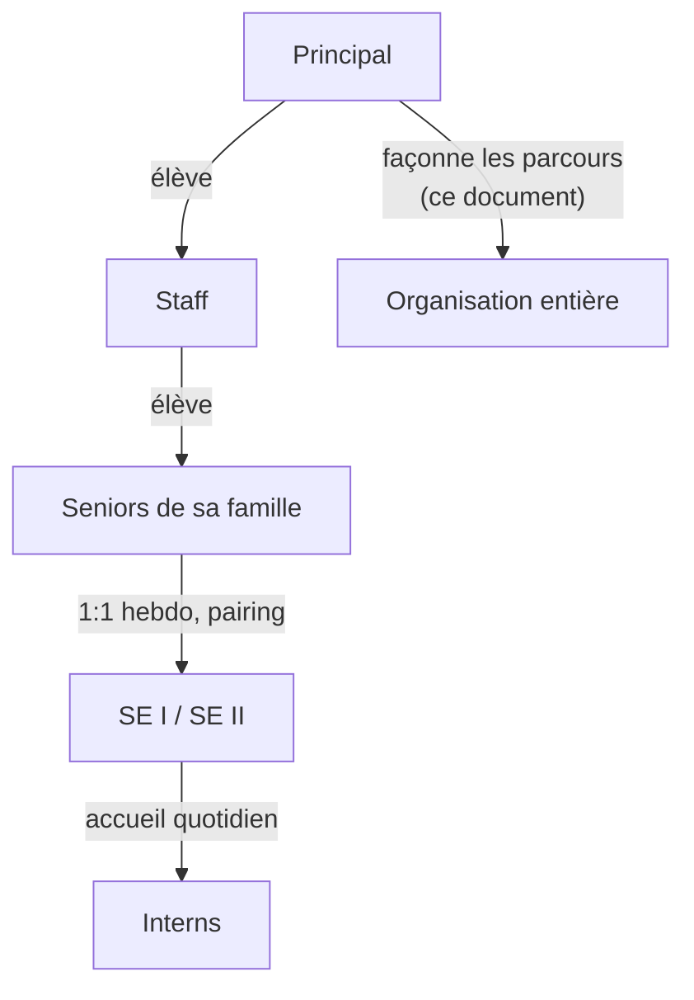
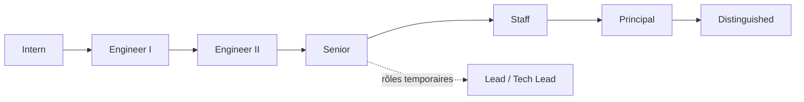
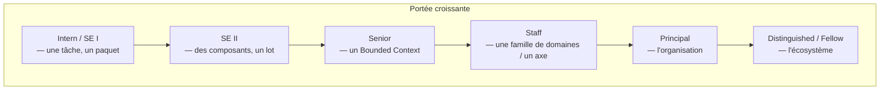
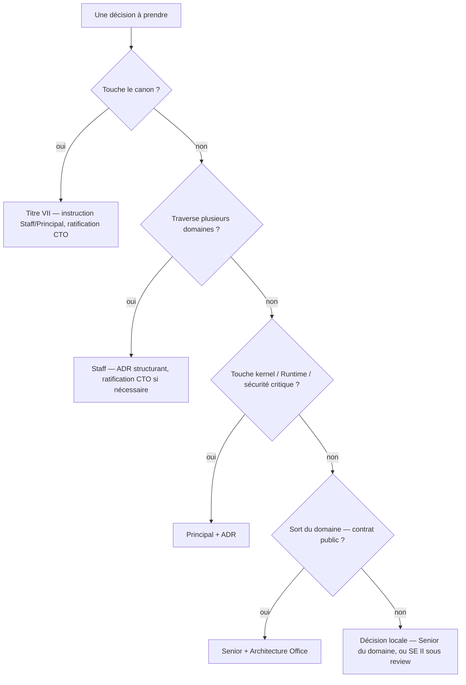
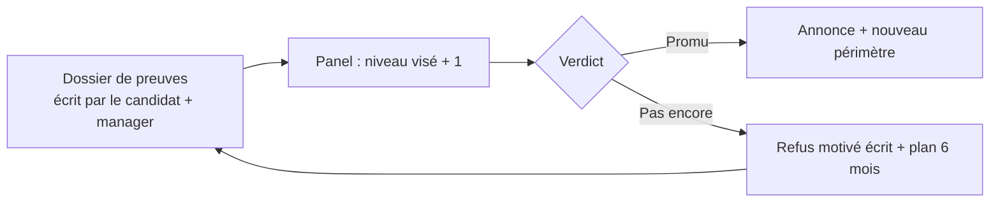
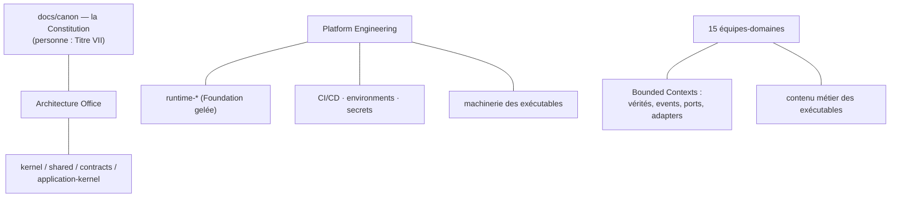

# Engineering Career Ladder

**MentoraOS — Référence officielle de l'évolution des ingénieurs**

| | |
|---|---|
| **Version** | 1.0 |
| **Statut** | Référence officielle (Phase 3.1A) |
| **Propriétaire** | CTO (Head of Engineering Excellence) |
| **Documents liés** | [Engineering Organization](engineering-organization.md) · Constitution (`docs/canon/`, tag `foundation-v1.0.0`) |
| **Règle de préséance** | En cas d'ambiguïté, la Constitution R2 prévaut toujours |

---

## 1. Vision

Mentora possède une Career Ladder parce qu'une organisation qui grandit sans échelle explicite promeut au hasard, évalue à l'affect et perd ses meilleurs ingénieurs dans le flou. L'échelle rend l'évolution **prévisible, opposable et juste** : dans cinq ans, un ingénieur qui rejoint Mentora ouvre ce document et sait exactement ce qu'on attend de lui, quelles décisions il peut prendre, et ce qui le sépare du niveau suivant.

L'échelle est fondée sur trois axes — et jamais sur l'ancienneté seule :

- **Responsabilité** — ce que l'ingénieur *possède* : un périmètre dont il répond, en succès comme en échec. On ne monte pas en accumulant des années ; on monte en portant durablement un périmètre plus large.
- **Impact** — ce qui *change* parce que cet ingénieur existe : des lots livrés gate verte, des défauts trouvés avant la production, des équipes débloquées, des décisions qui tiennent dans le temps.
- **Autonomie** — la taille du problème qu'on peut lui confier *sans cadrage* : d'une tâche découpée (Intern) à une ambiguïté organisationnelle entière (Principal+).

L'ancienneté mesure le temps passé ; l'échelle mesure ce que ce temps a produit. Deux ans d'impact réel valent plus que dix ans de présence.

---

## 2. Principes

Chaque principe est défini, justifié, et **évaluable** — un principe qu'on ne peut pas évaluer n'est pas un principe, c'est un slogan.

| Principe | Définition | Pourquoi il existe | Comment il est évalué |
|---|---|---|---|
| **Ownership** | Posséder un périmètre, c'est en répondre : qualité, dette, documentation, incidents — pas seulement les features | « Une vérité = un propriétaire » (Constitution) s'applique aussi aux personnes ; sans propriétaire, tout se dégrade silencieusement | Le périmètre possédé est-il en meilleur état qu'à la prise de possession ? Les incidents y sont-ils traités sans qu'on le demande ? |
| **Accountability** | Rendre compte fidèlement : dire ce qui est fait, pas fait, cassé — sans embellir | Le rapport CTO de chaque lot dit vrai ou ne sert à rien ; « ne jamais dire terminé sans avoir exécuté toute la gate » | Les rapports correspondent-ils à la réalité vérifiable (gates, commits, tests) ? Les échecs sont-ils annoncés avant d'être découverts ? |
| **Technical Excellence** | Le travail tient la gate : 0 erreur, 0 warning, couverture ≥95 %, à froid | La gate est la matérialisation exécutable de l'excellence ; elle ne se négocie pas | Taux de lots verts du premier coup ; profondeur des causes racines trouvées (pas des symptômes) |
| **Collaboration** | Travailler par contrats publiés et revues — jamais par contournement ou couloir | Les équipes épousent les Bounded Contexts ; la collaboration hors contrat crée du couplage invisible | Les dépendances créées passent-elles par des interfaces publiées ? Les revues données sont-elles utiles et argumentées ? |
| **Mentoring** | Faire monter les autres : chaque niveau élève le niveau d'en dessous | Une organisation qui ne transmet pas plafonne à la taille de ses seniors | Qui a progressé grâce à cette personne ? (Preuves : revues pédagogiques, pairing, promotions accompagnées) |
| **Simplicity** | La solution la plus simple compatible avec la Constitution — « Simple before Clever » | La complexité non nécessaire est la première dette ; le canon interdit déjà les mécanismes non requis (pas de moteur event-sourcing, delta=0…) | Les solutions retenues sont-elles expliquables en une page ? Les abstractions créées ont-elles ≥2 usages réels ? |
| **Architecture First** | Comprendre les lois du périmètre AVANT d'écrire ; relire les chapitres propriétaires avant chaque lot | Le processus de lot l'exige : relecture R2 → comparaison au code gelé → STOP argumenté si contradiction | Les STOP émis sont-ils justes ? Les contradictions sont-elles détectées avant le code plutôt qu'en revue ? |
| **Documentation** | Écrire ce qui ne se déduit pas du code : décisions, contraintes, provenances — au moment où on les prend | « Documentation before Memory » : la mémoire ment, la trace fait foi ; la doc n'a aucun pouvoir éditorial sur les sources ratifiées | ADR/README à jour au merge ; un nouvel arrivant peut-il reprendre le périmètre sans interview ? |
| **Testing** | La preuve fait partie du travail : contract suites, doubles de référence, tests d'architecture | Le premier boot réel a trouvé un défaut que dix lots de tests unitaires ne voyaient pas — la preuve doit viser le réel | Les tests prouvent-ils des comportements (contrats) ou des implémentations ? Les bugs clos ont-ils leur test de non-régression ? |
| **Continuous Learning** | Rester à jour sur son art ; apprendre du canon, des audits, des post-mortems | La Constitution elle-même est née d'audits en feuille blanche répétés | Participation aux revues d'audit ; capacité à citer et appliquer les lois nouvelles de son périmètre |

---

## 3. Les niveaux Engineering

Huit niveaux. Chaque niveau **contient** les exigences des niveaux précédents. Les niveaux Staff+ sont des rôles de *leadership technique sans autorité hiérarchique* : ils convainquent par la preuve, ils ne commandent pas.

### 3.1 Engineering Intern

| Axe | Attendu |
|---|---|
| Mission | Apprendre le système en livrant de petites unités réelles, encadrées |
| Portée | Une tâche découpée, dans un seul paquet |
| Responsabilités | Livrer ce qui est cadré ; poser des questions tôt ; tenir la gate sur sa tâche |
| Décisions autorisées | Détails d'implémentation locaux, sous revue systématique |
| Autonomie | Cadrage complet fourni ; jamais seul sur un chemin critique |
| Complexité | Faible — pas d'ambiguïté à résoudre |
| ADR | Lecteur |
| RFC | Lecteur |
| Ownership | Aucun périmètre propre |
| Review de code | Reçoit ; peut commenter (non bloquant) |
| Mentorat | Est mentoré (parrain Senior+ obligatoire) |
| Communication | Statut clair sur sa tâche ; sait dire « je suis bloqué » sous 1 h |
| Leadership | — |
| Vision | Comprend le domaine où il travaille |
| Architecture | Lit le chapitre canon de son périmètre avant de coder |
| **Promotion vers SE I** | Livre seul une tâche cadrée gate verte ; a lu la Constitution d'entrée (onboarding) ; revues majoritairement propres |
| Exemples de missions | Ajouter un cas à une contract suite ; corriger un défaut reproduit et cadré ; écrire une Mother de test |

### 3.2 Software Engineer I

| Axe | Attendu |
|---|---|
| Mission | Livrer des unités de travail complètes dans un domaine, avec un cadrage léger |
| Portée | Un paquet ; des tickets d'un même domaine |
| Responsabilités | Qualité de bout en bout de ses livraisons (code + tests + doc locale) ; gate verte sans rappel |
| Décisions autorisées | Conception locale d'une fonction/classe ; choix de structure de tests |
| Autonomie | Cadrage par ticket ; sait découper une tâche floue en questions précises |
| Complexité | Un composant à la fois ; dépendances fournies |
| ADR | Lecteur ; peut proposer un sujet à son Senior |
| RFC | Lecteur, commentateur |
| Ownership | Co-propriétaire de modules dans son équipe (jamais seul propriétaire d'un chemin critique) |
| Review de code | Review les PR de complexité comparable dans son paquet (approbation non suffisante seule) |
| Mentorat | Accueille les Interns au quotidien |
| Communication | Écrit des descriptions de PR complètes ; documente ses choix non évidents |
| Leadership | Montre l'exemple sur la discipline de gate |
| Vision | Connaît les lois de son domaine (chapitre F2/F3 propriétaire) |
| Architecture | Applique les patterns maison (Séquences, canaux, naming) sans les réinventer |
| **Promotion vers SE II** | Enchaîne les lots verts sans supervision rapprochée ; détecte seul une contradiction mandat/canon au moins une fois (STOP argumenté juste) |
| Exemples de missions | Implémenter une commande ratifiée de bout en bout ; écrire l'adapter d'un port existant ; migrer un module vers un preset |

### 3.3 Software Engineer II

| Axe | Attendu |
|---|---|
| Mission | Posséder des composants entiers ; livrer des lots complets en autonomie |
| Portée | Plusieurs paquets d'un domaine ; un lot de bout en bout |
| Responsabilités | Conception + implémentation + preuve d'un lot ; qualité durable de ses composants ; dette signalée et chiffrée |
| Décisions autorisées | Conception d'un composant ; découpage d'un lot en étapes ; choix techniques locaux documentés |
| Autonomie | Un lot cadré par son objectif, pas par ses étapes |
| Complexité | Ambiguïté locale — sait quand trancher et quand STOP |
| ADR | Auteur (avec sponsor Senior+) pour son périmètre |
| RFC | Commentateur actif |
| Ownership | Propriétaire de composants nommés dans la matrice d'équipe |
| Review de code | Review de référence dans son paquet ; peut approuver seul une PR locale non critique |
| Mentorat | Mentore les SE I (pairing régulier) |
| Communication | Rapports de lot fidèles ; sait écrire un README de paquet complet |
| Leadership | Tient la qualité de son périmètre face à la pression du délai |
| Vision | Comprend les domaines voisins et leurs contrats |
| Architecture | Sait replacer chaque choix local dans les lois du canon (cite les articles) |
| **Promotion vers Senior** | A porté plusieurs lots complexes verts ; ses composants n'ont pas généré d'incidents récurrents ; ses revues élèvent les autres ; a émis des STOP justes et documentés |
| Exemples de missions | Un lot 2B-x complet (adapter + tests réels + rapport) ; une contract suite nouvelle ; un module runtime consommé par d'autres |

### 3.4 Senior Software Engineer

| Axe | Attendu |
|---|---|
| Mission | Posséder un domaine ou un pilier ; garantir que tout ce qui en sort respecte le canon |
| Portée | Un Bounded Context entier (ou un siège Platform), y compris sa dette et sa roadmap technique |
| Responsabilités | Santé du domaine (code, tests, docs, incidents) ; arbitrages internes ; qualité des contrats publiés ; montée du niveau de l'équipe |
| Décisions autorisées | Toute décision *locale* au domaine ; conception des évolutions additives de contrats (V-2) ; priorisation technique interne |
| Autonomie | Un objectif trimestriel ; découpe lui-même les lots |
| Complexité | Ambiguïté d'un domaine entier ; interactions multi-composants |
| ADR | Auteur autonome ; sa signature engage son domaine |
| RFC | Auteur ; répond aux commentaires de bout en bout |
| Ownership | Propriétaire de Bounded Context (nommé dans l'Ownership Matrix) |
| Review de code | Approbation requise sur tout ce qui touche son domaine ; dernier mot local (sous réserve §5) |
| Mentorat | Fait progresser nommément des SE I/II (objectif : les rendre autonomes, pas dépendants) |
| Communication | Interface de son domaine vers PM et les autres équipes ; écrit pour être compris hors de son équipe |
| Leadership | Tient un refus techniquement fondé face à n'importe qui, preuves à l'appui |
| Vision | Roadmap technique du domaine à 6-12 mois |
| Architecture | Garant de la conformité constitutionnelle de son domaine ; instruit les dossiers Titre VII qui le concernent |
| **Promotion vers Staff** | Son influence dépasse durablement son domaine : patterns repris ailleurs, ADR transverses, arbitrages inter-équipes sollicités |
| Exemples de missions | Posséder Engagement de bout en bout ; concevoir la stratégie de persistance d'un domaine ; mener l'instruction d'un amendement |

### 3.5 Staff Engineer

| Axe | Attendu |
|---|---|
| Mission | Résoudre les problèmes qui traversent plusieurs équipes ; faire converger sans autorité hiérarchique |
| Portée | Une famille de domaines (ex. Customer Journey) ou un axe transverse (persistance, observabilité) |
| Responsabilités | Cohérence inter-domaines ; qualité des frontières (ACL, contrats) ; désamorcer les collisions d'ownership avant qu'elles n'arrivent au CTO |
| Décisions autorisées | Trancher un différend technique inter-équipes (appel possible au CTO) ; standards transverses via ADR |
| Autonomie | Une ambiguïté organisationnelle-technique ; choisit lui-même ses batailles avec le CTO |
| Complexité | Systémique — plusieurs domaines, plusieurs équipes, contraintes contradictoires |
| ADR | Auteur des ADR structurants ; relecteur attendu de tous les ADR de sa famille |
| RFC | Auteur des RFC transverses ; anime les périodes de commentaires |
| Ownership | Propriétaire d'un *axe* (jamais d'un domaine en plus — il ne double pas un Senior) |
| Review de code | Requis sur les changements transverses (kernel-adjacent, contrats multi-domaines) |
| Mentorat | Mentore des Seniors ; fait émerger les futurs propriétaires de domaines |
| Communication | Écrit les documents que toute l'ingénierie lit ; vulgarise le canon |
| Leadership | Leadership d'influence : on le suit parce qu'il a raison de façon vérifiable |
| Vision | Voit les problèmes 2-3 lots avant qu'ils n'existent |
| Architecture | Co-anime l'Architecture Office ; garde des frontières entre contextes |
| **Promotion vers Principal** | A changé la trajectoire technique de l'organisation entière au moins une fois, de façon documentée et durable |
| Exemples de missions | Unifier la stratégie Outbox/Inbox entre trois domaines ; concevoir le découpage des espèces d'exécutables en production ; auditer une famille entière |

### 3.6 Principal Engineer

| Axe | Attendu |
|---|---|
| Mission | La santé technique de Mentora entière ; le bras droit technique du CTO |
| Portée | Toute l'organisation ; les décisions qui engagent des années |
| Responsabilités | Direction technique de fond (avec le CTO) ; les paris technologiques ; l'intégrité de la Constitution dans le temps ; les crises majeures |
| Décisions autorisées | Standards organisation entière (ratification CTO) ; veto technique argumenté sur tout lot (appel : CTO seul) |
| Autonomie | Se saisit lui-même des sujets ; rend compte au CTO |
| Complexité | Existentiel — ce qui peut faire échouer l'entreprise techniquement |
| ADR | Autorité de relecture finale ; peut exiger un ADR là où il n'y en a pas |
| RFC | Peut ouvrir une RFC sur n'importe quel sujet ; ses RFC cadrent les autres |
| Ownership | Le système *en tant que système* (jamais un domaine — il ne remplace personne) |
| Review de code | Obligatoire sur : kernel, Runtime Foundation, sécurité critique, Constitution (§5) |
| Mentorat | Élève les Staff ; conçoit les parcours (ce document est son outil) |
| Communication | Parle pour l'ingénierie devant l'exécutif ; écrit ce qui fait référence 5 ans |
| Leadership | Incarne les valeurs ; son comportement EST le standard |
| Vision | Trajectoire technique à 3-5 ans, alignée sur la vision CEO |
| Architecture | Co-signe les amendements Titre VII avec le CTO ; garde ultime des invariants |
| **Promotion vers Distinguished** | Contribution reconnue au-delà de Mentora ; le système qu'il a façonné survit à son quotidien |
| Exemples de missions | Instruire un amendement constitutionnel majeur ; concevoir la stratégie multi-région ; redresser un domaine en crise |

### 3.7 Distinguished Engineer

| Axe | Attendu |
|---|---|
| Mission | Repousser l'état de l'art de Mentora ; représenter son excellence au-dehors |
| Portée | Mentora + son écosystème (open source, publications, standards) |
| Responsabilités | Les problèmes que personne d'autre ne sait poser ; l'attractivité technique de Mentora |
| Décisions autorisées | Comme Principal ; ses recommandations font jurisprudence |
| ADR / RFC | Comme Principal ; ses écrits deviennent des références externes |
| Ownership | Aucun périmètre opérationnel — sa disponibilité est sa valeur |
| Mentorat | Élève les Principals ; rayonne par l'exemple |
| Vision | Où va l'industrie, et où Mentora doit être avant elle |
| **Promotion vers Fellow** | Exceptionnelle ; décision conjointe CEO+CTO |
| Exemples de missions | Publier l'approche constitutionnelle de Mentora ; standardiser un protocole ; résoudre un problème réputé insoluble en interne |

### 3.8 Engineering Fellow *(optionnel)*

Titre honorifique et rarissime : un Fellow a défini une part de ce que Mentora *est*. Aucune obligation opérationnelle ; accès permanent à toutes les instances techniques ; voix consultative au Titre VII. Nommé par le CEO et le CTO conjointement.

---

## 4. Decision Authority Matrix

**Légende** : ✅ = autorisé dans son périmètre · 🅁 = autorisé avec review du niveau indiqué · ❌ = non autorisé. Les colonnes héritent vers la droite (un Staff peut ce qu'un Senior peut, etc.). *Owner* = propriétaire du chemin dans l'Ownership Matrix.

| Action | Intern | SE I | SE II | Senior | Staff | Principal | CTO |
|---|---|---|---|---|---|---|---|
| Modifier un paquet (owned par son équipe) | 🅁 SE II+ | 🅁 SE II+ | ✅ | ✅ | ✅ | ✅ | ✅ |
| Modifier un domaine (vérités, contrats internes) | ❌ | 🅁 Senior | 🅁 Senior | ✅ (le sien) | 🅁 Owner | 🅁 Owner | ✅ |
| Modifier le kernel (`kernel`, `shared`, `contracts`, `application-kernel`) | ❌ | ❌ | ❌ | 🅁 Principal | 🅁 Principal | ✅ + ADR | ✅ |
| Créer un ADR | ❌ | proposition | 🅁 sponsor Senior | ✅ | ✅ | ✅ | ✅ |
| Approuver un ADR (structurant) | ❌ | ❌ | ❌ | domaine seul | famille | ✅ | ratifie |
| Ouvrir un RFC | ❌ | ❌ | 🅁 sponsor | ✅ | ✅ | ✅ | ✅ |
| Fusionner vers `main` | ❌ | ❌ | 🅁 (PR + gate + review §5) | ✅ (PR + gate) | ✅ | ✅ | ✅ |
| Modifier CI/CD (pipeline, gates) | ❌ | ❌ | ❌ | 🅁 Platform Owner | 🅁 Platform Owner | ✅ | ✅ |
| Modifier Runtime (`runtime-*`, Foundation gelée) | ❌ | ❌ | ❌ | 🅁 Principal + ADR | 🅁 Principal + ADR | ✅ + ADR | ✅ |
| Modifier Security (auth, secrets, chiffrement) | ❌ | ❌ | ❌ | 🅁 Security Owner | 🅁 Security Owner | ✅ + revue Sec | ✅ |
| Modifier Platform (infra, environments) | ❌ | ❌ | 🅁 Platform | 🅁 Platform Owner | ✅ | ✅ | ✅ |
| Modifier Design System | ❌ | 🅁 DS Team | 🅁 DS Team | ✅ (DS Owner) | ✅ | ✅ | ✅ |
| Créer un nouveau paquet | ❌ | ❌ | 🅁 Senior + gabarit DX | ✅ (dans son domaine) | ✅ | ✅ | ✅ |
| Créer un nouveau domaine | ❌ | ❌ | ❌ | ❌ | ❌ | ❌ | **Titre VII uniquement** |
| Modifier la Constitution (`docs/canon/`) | ❌ | ❌ | ❌ | ❌ | instruction | instruction + co-signature | **ratification Titre VII** |

**Deux lois absolues** : (1) *personne* — CTO compris — ne modifie le canon hors procédure Titre VII ; (2) aucune ligne de cette matrice ne permet de contourner une gate ou une review obligatoire.

---

## 5. Code Review Ladder

**Principe** : la review suit l'*ownership du chemin* et la *criticité du contenu*, pas le grade de l'auteur. Plus le contenu est irréversible ou transverse, plus le réviseur requis est haut.

| Contenu de la PR | Réviseur minimal | Dernier mot |
|---|---|---|
| Code local d'un paquet, non critique (tests, docs, refactor interne) | **SE II** du paquet | Owner du paquet |
| Nouvelle fonctionnalité dans un domaine | **Senior** du domaine | Senior propriétaire |
| Contrat public (event, commande, query — création ou évolution V-2) | **Senior** du domaine + relecture **Staff** de la famille | Architecture Office (ratification CTO si nouveau contrat) |
| Changement transverse (plusieurs domaines, ACL, frontières) | **Staff** de l'axe | Staff, appel au Principal |
| Kernel, Runtime Foundation, schémas persistés (expand/contract), sécurité critique | **Principal** obligatoire | Principal, appel au CTO |
| Constitution, gouvernance, ce document | instruction Staff/Principal | **CTO seul** (Titre VII pour le canon) |

Règles :
- **Quand un SE II suffit** : la PR ne change aucun comportement public et reste dans un paquet dont l'équipe est propriétaire.
- **Quand un Senior suffit** : tout ce qui vit et meurt à l'intérieur d'un domaine.
- **Quand un Staff suffit** : tout ce qui traverse des frontières sans toucher au socle gelé.
- **Quand un Principal est obligatoire** : kernel, Runtime Foundation, sécurité critique, migrations de schéma, tout ce dont l'erreur est difficilement réversible.
- Une approbation n'est jamais un tampon : un réviseur qui approuve co-répond du défaut passé.
- L'auteur ne s'auto-approuve jamais, quel que soit son niveau — CTO compris (à 2 développeurs, l'autre développeur review ; la règle est la topologie, pas le nombre).

---

## 6. Architecture Ownership

| Artefact | Propriétaire | Précisions |
|---|---|---|
| **Bounded Contexts** (15) | L'équipe-domaine ; à défaut d'équipe, le Senior nommé dans l'Ownership Matrix | La *carte* des contextes appartient à l'Architecture Office ; l'intérieur au domaine |
| **Packages** | L'équipe dont le chemin figure dans l'Ownership Matrix | Un paquet sans propriétaire ne peut pas être créé (anti-pattern #9) |
| **APIs** (surfaces publiques) | Le domaine qui les sert ; la *forme* transversale (conventions) à l'Architecture Office | |
| **Events** | Le domaine qui les publie (F2.2 fait foi) | Registre des générations : Architecture Office |
| **Contracts** (paquets `contracts*`) | Architecture Office (socle) ; `contracts-<domaine>` : le domaine, ratification Architecture Office | Suppression/renommage = nouveau contrat = Titre VII |
| **Adapters** | Le domaine consommateur du port (« les ports appartiennent aux consommateurs ») | Le fournisseur (Prisma, broker…) n'est jamais propriétaire de rien |
| **Runtime Modules** (`runtime-*`) | Platform Engineering | Foundation gelée : modification = ADR + Principal + ratification CTO |
| **Foundations** (kernel, shared, contracts, application-kernel, canon) | Architecture Office ; ratification CTO | Le canon lui-même : personne — Titre VII |
| **Documents** | `docs/canon/` : la Constitution (aucun pouvoir éditorial) · `docs/organization/` : CTO · `docs/architecture/`, ADR/RFC : Architecture Office · README de paquets : l'équipe propriétaire | La Documentation Team maintient, ne décide pas |

---

## 7. Promotion Framework

Le processus : dossier écrit (preuves, pas d'adjectifs) → revue par un panel du niveau visé + 1 → décision CTO (Staff+ : CTO obligatoire ; Distinguished/Fellow : CEO+CTO). Cadence semestrielle. Un refus est motivé par écrit et assorti d'un plan.

| Vers | Conditions minimales | Réalisations attendues (exemples) | Leadership attendu | Erreurs fréquentes | Pourquoi un refus |
|---|---|---|---|---|---|
| **SE I** | 1 tâche livrée seule, gate verte ; onboarding canon terminé | Un correctif complet avec test de non-régression | Fiabilité sur l'engagé | Coder avant de lire le chapitre propriétaire | Besoin de supervision constante |
| **SE II** | Lots verts répétés sans rappel qualité | Une commande de bout en bout ; un adapter de port | Tenue de la gate sous délai | Confondre vitesse et impact ; sur-ingénierie | Qualité irrégulière ; revues superficielles |
| **Senior** | Ownership durable de composants sains ; STOP argumentés justes | Un lot complexe mené seul ; une contract suite de référence | Élève les SE autour de lui | Vouloir tout faire soi-même ; garder le savoir | Composants sans docs ; incidents récurrents ; mentorat absent |
| **Staff** | Influence transverse prouvée (patterns repris, arbitrages sollicités) | Un ADR structurant adopté ; une convergence inter-domaines menée | Convainc sans autorité | Se comporter en super-Senior d'un seul domaine | Impact non mesurable hors de son équipe |
| **Principal** | A changé la trajectoire de l'organisation, preuve écrite | Un standard organisation entière ; une crise majeure résolue proprement | Les autres montent grâce à lui | Trancher par autorité au lieu de preuve | Influence qui ne survit pas à son absence |
| **Distinguished** | Rayonnement au-delà de Mentora | Publication/standard/OSS reconnu | Référence externe | Chercher le titre, pas l'œuvre | Contribution interne devenue marginale |

**Un refus de promotion n'est jamais une sanction** : c'est le constat écrit que les preuves du niveau visé n'existent pas encore. Le dossier suivant repart des mêmes critères — ils ne bougent pas entre deux candidats.

---

## 8. Mentoring Model

- **Senior → Engineer** : relation nommée (pas « l'équipe mentore ») ; 1:1 hebdomadaire ; pairing sur les lots difficiles ; l'objectif contractuel est l'*autonomie* du mentoré — un Senior dont les mentorés restent dépendants échoue.
- **Staff → équipes** : mentorat par les artefacts (ADR exemplaires, revues pédagogiques, ateliers d'architecture) ; identifie et prépare les futurs propriétaires de domaines ; débloque les Seniors sur les problèmes systémiques.
- **Principal → organisation** : mentorat par les structures (parcours, standards, ce document) ; élève les Staff en les exposant à des décisions de niveau organisation ; son calendrier réserve du temps non planifié pour être *trouvable*.

---

## 9. Technical Leadership

| Rôle | Nature | Périmètre | Différence clé |
|---|---|---|---|
| **Lead Engineer** | Rôle d'équipe (pas un niveau) | Coordination technique d'une équipe/squad | Tournant possible ; un SE II confirmé ou Senior le porte |
| **Tech Lead** | Rôle de projet (pas un niveau) | Un lot/projet multi-personnes, le temps du projet | Meurt avec le projet ; l'ownership du domaine reste au Senior |
| **Staff** | Niveau | Une famille de domaines / un axe | Influence *durable* inter-équipes, pas un projet |
| **Principal** | Niveau | L'organisation | Trajectoire pluriannuelle, bras droit du CTO |
| **Distinguished** | Niveau | Mentora + l'extérieur | L'état de l'art lui-même |

**La distinction fondamentale** : *Lead/Tech Lead* sont des **rôles** — temporaires, contextuels, attribués et repris sans promotion ni rétrogradation. *Staff/Principal/Distinguished* sont des **niveaux** — permanents, attachés à la personne, gagnés par preuves. Confondre les deux détruit les échelles : on ne « nomme » pas un Staff, on *constate* qu'il l'est déjà.

---

## 10. Engineering Values

| Valeur | Définition | Exemple concret | Anti-patterns |
|---|---|---|---|
| **Quality over Speed** | La vitesse se mesure sur un an, pas sur un sprint | Reporter une livraison plutôt que fusionner à 94 % de couverture | « On testera après » ; gate contournée « exceptionnellement » |
| **Architecture over Convenience** | La frontière prime sur le raccourci | Écrire l'ACL plutôt qu'importer l'interne du domaine voisin | « C'est juste un import » ; couplage temporaire devenu permanent |
| **Tests before Merge** | La preuve accompagne le changement, jamais ne le suit | Le bug corrigé arrive AVEC son test de non-régression | PR « tests à venir » ; tests qui prouvent l'implémentation, pas le contrat |
| **Documentation before Memory** | Ce qui n'est pas écrit au moment de la décision est perdu | L'ADR rédigé le jour du choix, pas au départ de son auteur | « Je documenterai plus tard » ; savoir tribal |
| **Ownership over Authority** | On répond d'un périmètre, on ne règne pas dessus | Le Senior répare l'incident de son domaine un vendredi soir sans qu'on demande | « C'est pas mon code » ; posséder sans entretenir |
| **Simple before Clever** | L'ingéniosité se paie à la relecture | Delta=0 par construction plutôt qu'un moteur d'event-sourcing configurable | Abstraction à usage unique ; méta-programmation gratuite |
| **Automation over Repetition** | Toute tâche répétée trois fois devient un outil | Le générateur de domaine DX plutôt que le copier-coller de gabarits | Checklists manuelles infinies ; « on a toujours fait comme ça » |
| **Long-term Thinking** | Chaque décision est écrite pour l'ingénieur de dans 5 ans | Les rapports de lot racontent le *pourquoi*, pas seulement le *quoi* | Optimiser la démo ; dette non chiffrée |
| **Respect the Constitution** | Le canon est la loi ; le désaccord passe par le Titre VII, jamais par le contournement | Un STOP argumenté plutôt qu'une « interprétation créative » du mandat | Compléter le Corpus soi-même ; inventer du vocabulaire hors dictionnaire |

---

## 11. Anti-patterns

Comportements incompatibles avec Mentora. Les récurrents bloquent toute promotion ; certains (marqués ⚠) déclenchent un entretien immédiat.

**Git & process**
1. ⚠ Pousser directement sur `main` sans PR ni gate
2. ⚠ Réécrire l'histoire publiée (force-push, rebase de branches partagées)
3. Fusionner sans review du niveau requis (§5)
4. S'auto-approuver
5. Dire « terminé » sans avoir exécuté toute la gate
6. Contourner un ADR existant parce qu'on n'était « pas d'accord »
7. Ignorer ou tamponner les reviews (« LGTM » sans lecture)
8. Découper un changement critique en petites PR pour éviter le réviseur requis

**Constitution & architecture**
9. ⚠ Modifier `docs/canon/` hors Titre VII
10. Compléter le Corpus soi-même (inventer ce que la source ne dit pas)
11. Inventer du vocabulaire hors dictionnaire bilingue (ou utiliser un mot réservé : Snapshot, Journal, Export, Session, Messaging, Outbox nu…)
12. Créer un quatrième chemin d'exécution (hors Commande/Lecture/Réaction)
13. Mélanger les trois canaux (traiter un Refus comme une erreur, retenter un Refus, avaler une Exception)
14. Importer les internes d'un autre domaine au lieu de ses contrats publiés
15. Créer une dépendance circulaire entre paquets (le graphe est un DAG, I-12)
16. Faire écrire une vérité par un composant qui n'en est pas propriétaire
17. Publier un fait depuis un Process Manager, ou commander hors Dispatch
18. Contourner les Foundations (réimplémenter clock/config/logging localement)

**Code & design**
19. Utiliser un Singleton global ou un Service Locator (`resolve()`, `get()`) hors Root
20. `Date.now()`/`Math.random()` ambiants hors SystemClock/UuidFactory
21. Introduire du couplage caché (flag d'env non déclaré gouvernant le métier)
22. Créer un paquet sans propriétaire déclaré dans l'Ownership Matrix
23. Abstraction spéculative (port sans deuxième implémentation plausible, config sans consommateur)
24. Laisser un type du fournisseur remonter au-dessus du Root (les types de l'extérieur meurent aux adapters)
25. Écrire un composant qui juge le métier dans une surface runtime (health qui juge le backlog)

**Preuve & qualité**
26. Écrire sans tests, ou tests après merge
27. Clore un bug sans test de non-régression
28. Baisser un seuil de couverture pour passer
29. Masquer un test flaky par retry au lieu de le corriger
30. Doubler en mémoire ce qui doit être prouvé sur infrastructure réelle (le défaut vitest-dans-les-barrels a survécu dix lots ainsi)

**Documentation & communication**
31. Documenter après coup (ou jamais)
32. Rapporter un état embelli (« ça marche » sans gate exécutée)
33. Garder le savoir pour se rendre indispensable
34. Décider en couloir sans trace écrite
35. Laisser un incident sans post-mortem, ou un post-mortem sans action

---

## 12. Career Roadmap

| Étape | Compétences à acquérir pour la franchir |
|---|---|
| **Intern → Engineer I** | Lire le canon de son périmètre ; livrer petit et fini ; demander de l'aide tôt ; tenir la gate sur sa tâche |
| **Engineer I → Engineer II** | Découper l'ambigu en précis ; écrire des tests qui prouvent des contrats ; détecter une contradiction mandat/canon (le STOP juste) ; reviews utiles |
| **Engineer II → Senior** | Posséder dans la durée (dette, docs, incidents) ; concevoir un lot entier ; mentorer ; dire non avec preuves |
| **Senior → Staff** | Penser en frontières plutôt qu'en features ; convaincre par écrit ; résoudre entre équipes sans autorité ; choisir ses batailles |
| **Staff → Principal** | Penser en années ; transformer des crises en standards ; élever des Seniors en propriétaires ; co-porter la Constitution |
| **Principal → Distinguished** | Produire ce qui fait référence hors de Mentora ; rendre son influence indépendante de sa présence |

La progression n'est **pas un entonnoir obligatoire** : un excellent Senior à vie est un succès de carrière, pas un échec. L'échelle récompense la profondeur autant que l'ascension.

---

## 13. Appendices

### 13.1 Vue d'ensemble — niveaux × portée

### 13.2 Decision flow — « qui décide ? »

### 13.3 Promotion flow

### 13.4 Responsibility map — rappel synthétique

| Niveau | Possède | Décide | Review requise de lui | Mentore |
|---|---|---|---|---|
| Intern | — | détails locaux (sous review) | — | — |
| SE I | modules (co) | conception locale | PR comparables | Interns |
| SE II | composants | conception d'un lot | PR de son paquet | SE I |
| Senior | un Bounded Context | tout le local du domaine | tout son domaine | SE I/II |
| Staff | un axe transverse | différends inter-équipes | transverse | Seniors |
| Principal | le système | standards org (ratif. CTO) | kernel/Runtime/sécurité | Staff |
| Distinguished | — (l'état de l'art) | jurisprudence | sur demande | Principals |

### 13.5 Ownership map — artefacts × gardiens

---

*Ce document est la référence officielle d'évolution des ingénieurs de Mentora. Il se lit avec l'[Engineering Organization](engineering-organization.md). En cas d'ambiguïté entre ce document et la Constitution R2, la Constitution prévaut — toujours.*
