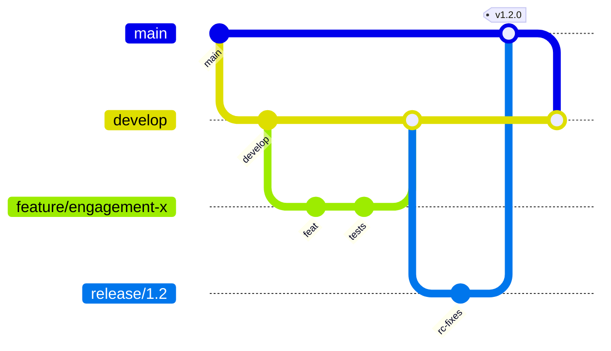
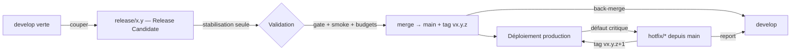
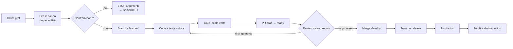
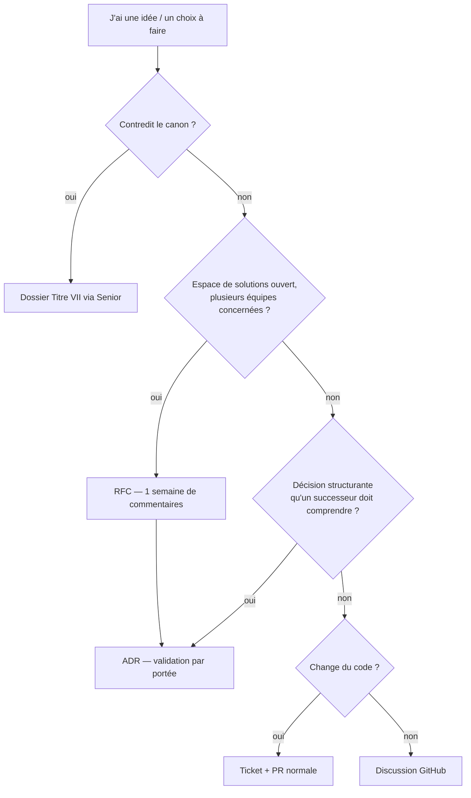
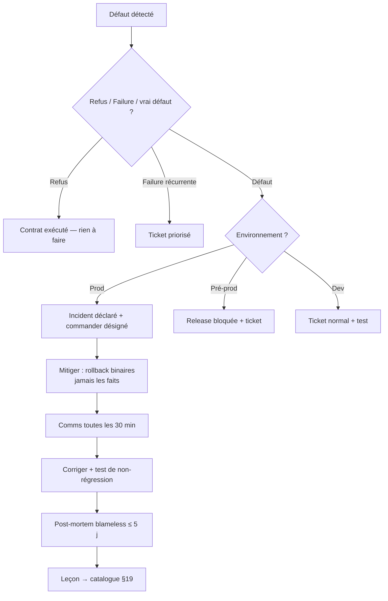

# Engineering Handbook

**MentoraOS — Le manuel officiel du travail quotidien de l'ingénierie**

| | |
|---|---|
| **Version** | 1.0 |
| **Statut** | Référence officielle (Phase 3.2) — premier document lu par tout nouvel ingénieur |
| **Propriétaire** | CTO (VP Engineering) |
| **Documents liés** | Constitution (`docs/canon/`) · [Engineering Organization](engineering-organization.md) · [Engineering Career Ladder](engineering-career-ladder.md) |
| **Préséance** | En cas de conflit, la Constitution R2 prévaut — toujours |

---

## 1. Introduction

Bienvenue chez Mentora. Avant ta première ligne de code, lis ce manuel en entier : il t'explique **comment nous travaillons** — pas ce que le système fait (la Constitution le dit), pas qui possède quoi (l'Organization le dit), pas comment évoluer (la Career Ladder le dit), mais comment se passe une journée, une PR, un incident, une release.

**Notre manière de construire du logiciel.** Mentora est un système constitutionnel : un corpus de lois ratifiées (`docs/canon/`, gelé au tag `foundation-v1.0.0`) définit les domaines, le vocabulaire, les invariants et les chemins d'exécution. Le code *implémente* la Constitution ; il ne la *légifère* jamais. Concrètement : avant d'écrire, on lit les chapitres propriétaires de son périmètre ; quand un mandat contredit le canon, on s'arrête et on argumente (le **STOP argumenté** — c'est un acte valorisé, pas un échec) ; quand une information manque au Corpus, on ne l'invente jamais.

**Pourquoi la qualité prime sur la vitesse.** Notre gate (0 erreur, 0 warning, couverture ≥95 %, exécutée à froid) n'est pas une contrainte bureaucratique : c'est ce qui permet d'aller *vite pendant des années*. Un raccourci gagne une journée et coûte un trimestre. L'histoire du projet le prouve : le premier boot réel a tué en une seconde un défaut de packaging que dix lots de tests unitaires n'avaient jamais vu — la preuve doit viser le réel, et la vitesse se mesure sur un an.

**Pourquoi la Constitution existe.** Parce que les décisions non écrites se re-prennent, se contredisent et se perdent. La Constitution est née de phases d'audit répétées (jusqu'à des reconstructions en feuille blanche qui reconvergent) ; elle est la mémoire opposable du système. Le Titre VII est sa seule voie d'évolution.

**Pourquoi les Foundations existent.** Le kernel, les contrats, l'application-kernel et les dix paquets `runtime-*` sont le socle gelé : une seule horloge licite, une seule fabrique d'identités, une seule lecture de l'environnement, un seul cycle de vie d'exécutable. Chaque équipe construit *au-dessus*, jamais *à côté*.

**Pourquoi la documentation précède le code.** Une décision non écrite au moment où elle se prend est perdue (« Documentation before Memory »). Les ADR se rédigent le jour du choix ; les rapports de lot disent le vrai ; la doc reproduit la dernière source ratifiée et n'a aucun pouvoir éditorial dessus.

---

## 2. Les valeurs Engineering

Les valeurs officielles (source : Career Ladder §10 — reprises ici avec leur mode d'emploi quotidien).

| Valeur | Définition | Pourquoi | Exemple | Anti-pattern |
|---|---|---|---|---|
| **Quality over Speed** | La vitesse se mesure sur un an, pas sur un sprint | Un défaut en production coûte 100× sa correction en revue | Reporter un merge à demain plutôt que fusionner à 94 % de couverture | « On testera après » ; gate contournée « juste cette fois » |
| **Architecture over Convenience** | La frontière prime sur le raccourci | Le couplage « temporaire » devient permanent en un sprint | Écrire l'ACL plutôt qu'importer l'interne du domaine voisin | `import` direct entre domaines ; « c'est juste une lecture » |
| **Ownership over Authority** | On répond d'un périmètre, on ne règne pas dessus | Sans propriétaire qui répond, tout se dégrade en silence | Réparer l'incident de son domaine sans qu'on le demande | « C'est pas mon code » ; posséder sans entretenir |
| **Documentation before Memory** | Ce qui n'est pas écrit au moment de la décision est perdu | La mémoire embellit ; la trace fait foi | L'ADR rédigé le jour du choix | « Je documenterai plus tard » ; savoir tribal |
| **Automation over Repetition** | Toute tâche répétée trois fois devient un outil | Le temps humain est notre ressource la plus chère | Un générateur DX plutôt qu'un copier-coller de gabarits | Checklists manuelles infinies |
| **Simple before Clever** | La solution la plus simple compatible avec la Constitution | L'ingéniosité se paie à chaque relecture, pour toujours | Delta=0 par construction plutôt qu'un moteur configurable | Abstraction à usage unique ; méta-programmation gratuite |
| **Think Long Term** | Chaque décision est écrite pour l'ingénieur de dans 5 ans | Mentora est construite pour durer des décennies | Un rapport de lot qui raconte le *pourquoi* | Optimiser la démo ; dette non chiffrée |
| **Respect the Constitution** | Le canon est la loi ; le désaccord passe par le Titre VII | Un système constitutionnel contourné n'est plus un système | Un STOP argumenté plutôt qu'une « interprétation créative » | Compléter le Corpus soi-même ; vocabulaire hors dictionnaire |

---

## 3. Cycle de développement — une journée type

1. **Lecture du backlog** — ton équipe possède son backlog (PM priorise, l'équipe estime). Prends le premier ticket prêt de ta capacité ; s'il est flou, transforme le flou en questions écrites avant de coder.
2. **Lecture du canon** — *avant la branche* : relis les chapitres propriétaires du périmètre touché (F2 pour le domaine, F3 pour les unités, F4 pour les Séquences, les Blueprints pour la persistance/runtime). Si le ticket contredit le canon → **STOP argumenté** dans le ticket, tag de ton Senior. R2 gagne toujours.
3. **Création de branche** — depuis `develop` : `feature/<domaine>-<sujet-court>` (ou `fix/`, `docs/`, `chore/`). Une branche = un sujet.
4. **Développement** — code au-dessus des Foundations (jamais de `Date.now()` ambiant, jamais de `resolve()`, jamais d'import des internes d'un autre domaine). Les patterns maison s'appliquent : trois Séquences, trois canaux, naming du dictionnaire.
5. **Tests** — écrits AVEC le code, jamais après : unitaires + contract suite si un port est touché + intégration réelle si la persistance est touchée. Couverture ≥95 % sur ton paquet.
6. **Documentation** — README du paquet à jour, ADR si tu as tranché quelque chose de non évident, commentaire uniquement pour une contrainte que le code ne peut pas montrer.
7. **Commit** — atomique, message conventionnel (`feat(scope): …`, `fix(scope): …`, `docs(scope): …`), le *pourquoi* dans le corps. Jamais de secret dans un commit.
8. **Gate locale** — `pnpm verify` (typecheck, lint, test, build) vert AVANT d'ouvrir la PR. Une PR rouge fait perdre le temps du réviseur.
9. **Pull Request** — voir §5. Petite, décrite, testée.
10. **Review** — voir §6. Tu réponds à chaque commentaire ; tu remercies pour les défauts trouvés (un défaut trouvé en revue est une victoire, pas une vexation).
11. **Merge** — après approbation du niveau requis (Career Ladder §5) et gate CI verte. Jamais d'auto-approbation.
12. **Release & suivi** — ta responsabilité ne s'arrête pas au merge : tu suis ton changement jusqu'en production (métriques, logs) et tu réponds des incidents qu'il cause.

---

## 4. Git Workflow



| Branche | Rôle | Règles |
|---|---|---|
| **`main`** | La vérité de production ; chaque merge y est taggé | Protégée ; on n'y pousse JAMAIS directement ; n'avance que par PR depuis `release/*` ou `hotfix/*` |
| **`develop`** | L'intégration continue de toutes les features | Protégée ; n'avance que par PR ; toujours verte (une develop rouge bloque tout le monde → priorité absolue) |
| **`release/*`** | Stabilisation d'une version candidate | Coupée depuis `develop` ; ne reçoit que des correctifs de stabilisation ; fusionne dans `main` (tag) puis retour dans `develop` |
| **`feature/*`, `fix/*`, `docs/*`, `chore/*`** | Une branche = un sujet | Coupée depuis `develop` ; vie courte (< 1 semaine visée) ; supprimée après merge |
| **`hotfix/*`** | Correctif urgent de production | Coupée depuis `main` ; PR vers `main` (tag patch) puis reportée dans `develop` |
| **`arch-008-candidate`** | La branche historique Genesis | Préservée à vie ; on ne la supprime jamais ; elle ne reçoit plus que ce que le CTO ordonne |

**Quand créer une branche** : dès qu'un ticket démarre — jamais de travail sur `develop` directement. **Quand la supprimer** : immédiatement après merge (le bouton « delete branch » est ton ami). **Quand rebaser** : uniquement ta branche locale *non poussée* (ou poussée mais jamais revue par personne) pour la remettre à jour sur `develop` ; **jamais** une branche partagée, jamais `develop`/`release`/`main` — l'histoire publiée ne se réécrit pas. Une fois la review commencée : `merge develop` dans ta branche, pas de rebase. **Quand merger** : approbation requise + gate verte + conversation résolue. **Quand ouvrir une PR** : tôt — en brouillon (*draft*) dès que la direction est prise, pour que la review commence sur l'intention.

---

## 5. Pull Request Handbook

| Aspect | Règle |
|---|---|
| **Quand ouvrir** | Dès que la direction est claire — en draft ; « ready for review » quand la gate locale est verte |
| **Taille idéale** | ≤ 400 lignes modifiées hors tests/docs ; au-delà, découpe. Une PR = un sujet — jamais « et aussi » |
| **Titre** | Conventionnel : `feat(engagement): …` — le titre devient le message de merge |
| **Description** | Quatre blocs : **Quoi** (le changement), **Pourquoi** (ticket + contexte), **Comment prouvé** (tests, gate, captures), **Risques/limites** (ce qui reste à faire, dettes signalées) |
| **Checklist** | Gate locale verte · tests écrits avec le code · docs/README à jour · aucun secret · aucun import inter-domaines · vocabulaire du dictionnaire respecté |
| **Captures** | Obligatoires pour tout changement visuel (avant/après) ; pour un endpoint, la réponse réelle |
| **Tests** | La PR liste ce qu'elle prouve ; un comportement changé sans test modifié doit être justifié |
| **Labels** | domaine (`engagement`, `platform`…), nature (`feat`, `fix`, `docs`), criticité (`breaking`, `security`) |
| **Milestones** | La release cible si connue |
| **Reviewers** | Le niveau requis par le contenu (Career Ladder §5) — le propriétaire du chemin est toujours demandé |

**Une PR doit être refusée quand** : la gate est rouge ; elle mélange plusieurs sujets ; elle change un comportement sans test ; elle touche un contrat public sans ADR/ratification ; elle contourne une frontière de domaine ; elle contient un secret ; sa description ne permet pas de la comprendre sans appeler l'auteur. Refuser proprement = expliquer lequel de ces motifs s'applique, pas « je n'aime pas ».

---

## 6. Code Review Handbook

**L'état d'esprit** : la review protège le système, pas l'ego. On review le code, jamais la personne. L'auteur et le réviseur ont le même objectif : que le défaut soit trouvé *maintenant*.

**Ce qu'il faut regarder, dans cet ordre** :

1. **Architecture & DDD** — le changement est-il dans le bon domaine ? Respecte-t-il les frontières (contrats publiés, pas d'internes) ? Les trois Séquences ? Les trois canaux (un Refus n'est pas une erreur !) ? Le vocabulaire du dictionnaire ?
2. **Correction** — le comportement promis est-il le comportement codé ? Les cas limites (vide, doublon, conflit de version, panne du moteur) ?
3. **Tests** — prouvent-ils le *contrat* ou l'implémentation ? La couverture des branches nouvelles ? Le test de non-régression si c'est un fix ?
4. **Lisibilité** — un ingénieur qui ne connaît pas ce paquet peut-il le relire dans un an ? Les noms disent-ils le vrai ?
5. **Performance** — N+1, transactions trop larges, allocations en boucle chaude — au niveau de preuve adapté (mesure avant optimisation).
6. **Sécurité** — secrets, injections, données personnelles dans les logs, droits vérifiés au bon endroit (dispatch, pas gateway).
7. **Documentation** — README, ADR si décision, commentaires-contraintes.

**Comment critiquer constructivement** : chaque commentaire dit *quoi*, *pourquoi* (loi ou principe cité si applicable) et si c'est **bloquant** ou une **suggestion** (`nit:`). Proposer, pas seulement objecter. Poser une question quand on n'est pas sûr (« pourquoi ce choix ? » avant « c'est faux »). Approuver explicitement ce qui est bien — la review éduque dans les deux sens. Délai attendu : première réponse sous 24 h ouvrées ; une PR bloquée > 48 h s'escalade au Senior du domaine.

---

## 7. ADR Handbook

*(Le processus complet appartient à l'Architecture Office — Organization §2.2. Ceci est ton mode d'emploi.)*

- **Quand créer une ADR** : chaque fois que tu tranches quelque chose qu'un successeur pourrait retrancher autrement — choix de conception structurant, dépendance nouvelle, pattern transverse, compromis inhabituel. Test : « si quelqu'un demande *pourquoi c'est comme ça* dans deux ans, la réponse est-elle écrite quelque part ? »
- **Comment la rédiger** : gabarit maison — *Contexte* (le problème, les contraintes, les lois du canon applicables **citées**) → *Options* (≥2, avec leurs conséquences honnêtes) → *Décision* → *Conséquences* (y compris les dettes créées). Une page vaut mieux que dix.
- **Qui valide** : portée locale = le Senior du domaine ; structurante = Architecture Office puis ratification CTO ; constitutionnelle = ce n'est pas une ADR, c'est un dossier Titre VII.
- **Quand la modifier** : jamais — une ADR acceptée est immuable. On la **remplace** par une nouvelle qui la référence (« supersedes ADR-00XX »).
- **Quand la refuser** : options non explorées honnêtement, lois applicables non citées, décision déjà couverte par le canon (alors elle est redondante), ou contradiction avec le canon (alors c'est un Titre VII ou un abandon).

---

## 8. RFC Handbook

- **Quand ouvrir une RFC** : quand l'espace de solutions est *ouvert* et que la décision mérite plusieurs cerveaux — avant l'ADR, jamais à sa place. Une RFC explore ; une ADR tranche.
- **Structure** : Problème → Contraintes (lois citées) → Options avec analyse → Recommandation → Questions ouvertes.
- **Participants** : l'auteur (SE II sponsorisé, Senior+ autonome) ; les propriétaires des domaines touchés sont convoqués ; tout le monde peut commenter — par écrit uniquement, dans le document.
- **Période de commentaires** : 1 semaine par défaut ; le silence ne vaut pas accord — les propriétaires touchés *doivent* répondre.
- **Décision finale** : l'auteur synthétise ; le validateur du niveau concerné tranche (même échelle que les ADR) ; la décision devient une ADR si elle est structurante.
- **Archivage** : toutes les RFC (acceptées, refusées, abandonnées) restent dans `docs/canon/decisions/rfc/` avec leurs commentaires — un refus documenté vaut de l'or pour le prochain qui aura la même idée.

---

## 9. Incident Handbook

**D'abord, qualifier** — la Constitution distingue trois choses qu'on ne confond jamais :
- Un **Refus** (Decision) n'est PAS un bug : c'est le contrat qui s'exécute (créneau indisponible → `TimeSlotUnavailable`). Aucun incident.
- Une **Failure** technique transitoire (conflit optimiste, moteur injoignable) se retente bornée toute seule. Incident seulement si récurrente.
- Un vrai **défaut** (Exception, corruption, comportement contraire au contrat) = bug.

| Environnement | Réaction |
|---|---|
| **Production** | Incident déclaré immédiatement (canal dédié) ; un *incident commander* désigné ; mitiger d'abord (rollback binaire — jamais les faits), comprendre ensuite ; communication toutes les 30 min ; post-mortem obligatoire |
| **Pré-production** | Bloque la release en cours ; ticket prioritaire ; pas de cérémonie d'incident sauf si le défaut existe aussi en prod |
| **Développement** | Ticket normal ; si c'est une régression, le test manquant fait partie du fix |

**Priorisation** : P0 = perte de vérité, sécurité, indisponibilité totale (tout le monde s'arrête) ; P1 = fonction majeure cassée sans contournement (l'équipe propriétaire s'arrête) ; P2 = cassée avec contournement ; P3 = mineur. **La quarantaine du relais n'est jamais silencieuse** : toute enveloppe quarantainée est témoignée (log + métrique + santé) et traitée comme P2 minimum.

**Post-mortem** (sous 5 jours ouvrés, **blameless**) : chronologie factuelle → cause racine (les « 5 pourquoi » — s'arrêter à un nom de personne est interdit : on cherche le défaut du *système*) → ce qui a détecté / aurait dû détecter → actions datées avec propriétaires → leçon inscrite (si elle est générale, elle entre au catalogue §19 par PR sur ce document). Un bug clos sans test de non-régression n'est pas clos.

---

## 10. Documentation Handbook

| Artefact | Contenu attendu | Règle d'or |
|---|---|---|
| **README de paquet** | Mission, lois propriétaires citées, comment prouver (`pnpm verify`), pièges connus | Un nouvel arrivant reprend le paquet sans interview |
| **API / contrats** | Générée depuis les contrats — jamais écrite à la main en divergence | La forme documentée EST la forme servie |
| **Architecture** | Blueprints (`platform/docs/engineering/`), diagrammes Mermaid dans le repo | Le diagramme faux est pire que pas de diagramme : dater et maintenir |
| **Décisions** | ADR (immuables) et RFC (archivées) | La décision se documente le jour où elle se prend |
| **Runbooks** | Procédure exécutable pas-à-pas : symptôme → diagnostic → action → vérification | Les actes d'exploitation passent par les commandes ratifiées, jamais par le SQL direct |
| **Playbooks** | Procédures d'équipe (revue, release, onboarding) | Testés par le prochain nouvel arrivant |
| **Diagrammes** | Mermaid dans le Markdown (rendu GitHub natif) | Sources versionnées avec le texte, jamais d'images mortes |
| **Canon** | AUCUN pouvoir éditorial : il reproduit la dernière source ratifiée | Divergence constatée = ticket à l'Architecture Office, jamais une « correction » directe |

Style : écrire pour le lecteur de dans cinq ans ; le *pourquoi* avant le *comment* ; des phrases complètes ; le vocabulaire du dictionnaire bilingue.

---

## 11. Testing Handbook

**La pyramide de preuve Mentora** — chaque étage prouve ce que l'étage du dessous ne peut pas voir :

| Étage | Quoi | Obligatoire quand |
|---|---|---|
| **Unit** | Comportement d'un composant isolé (doubles maison : Mothers, Fixtures, Recording*) | Toujours — écrit AVEC le code |
| **Contract tests** | Les promesses d'un port, écrites UNE fois, rejouées sur chaque implémentation (mémoire ET réelle) | Dès qu'un port existe ; toute nouvelle implémentation rejoue la suite |
| **Integration** | Le vrai moteur (PostgreSQL réel jetable), les vraies contraintes (clé R-A, transactions sérialisables) | Dès que la persistance ou une frontière réelle est touchée |
| **End-to-End** | La boucle complète : commande → dispatch → Séquence → rétention → relais → lecture | Sur chaque exécutable ; c'est le filet qui a attrapé le défaut des barrels |
| **Smoke** | Le processus réel boote, répond à ses surfaces, meurt proprement | À chaque release candidate |
| **Performance / Load** | Budgets de latence par Séquence ; tenue en charge du relais | Sur environnement dédié, données de spec uniquement (S-9) |

**Coverage** : ≥95 % statements ET branches ET functions par paquet — c'est un plancher, pas une cible. On ne baisse jamais un seuil pour passer. Les exclusions (barrels, fils purs type `main.ts`) sont rares, justifiées par commentaire, et précédentées.

**Quand écrire les tests** : avec le code, dans la même PR — « Tests before Merge ». Un bug corrigé arrive AVEC son test de non-régression. Un test flaky se corrige, il ne se retry pas. **La gate froide** (0 cache) est la référence : ce que ta machine chaude cache, la gate froide le révèle.

---

## 12. Architecture Handbook

Le résumé opérationnel des lois que tu manipules tous les jours (le canon fait foi ; en cas de doute, lis le chapitre, pas ce tableau) :

| Concept | Comment le respecter |
|---|---|
| **DDD / Bounded Context** | Ton équipe = un domaine des 15. Tu ne touches pas l'intérieur d'un autre contexte ; tu consommes ses events publiés via ton Inbox |
| **Aggregate** | L'unité de cohérence (30 unités ratifiées en F3). Une transaction = une unité. Reconstruction = photo privée + delta (delta=0) — jamais de moteur event-sourcing |
| **Events** | Appartiennent au domaine qui les publie ; nés dans l'unique transaction de rétention (Outbox de faits) ; évolution additive (V-2), suppression = Titre VII |
| **Contracts** | Les seules portes entre domaines et vers l'extérieur ; versionnés par générations ; le lecteur est tolérant |
| **Adapters** | Une frontière, deux interlocuteurs (le fournisseur + le port). Les types du fournisseur meurent dans l'adapter ; classification des erreurs APRÈS rollback |
| **Runtime** | Les exécutables suivent le cycle en 9 états ; boot fail closed avec rapport COMPLET ; shutdown en ordre inverse ; « le Boot démontre et ne sert jamais » |
| **Foundations** | Une seule horloge (SystemClock), une seule identité (UuidFactory), une seule config (déclarée, fail closed), un seul Root par exécutable (Pure DI) |

**Ce qu'il est interdit de faire** (échantillon exécutoire — catalogue complet §19) : créer un quatrième chemin d'exécution ; mélanger Refus/Exception/Failure ; importer les internes d'un autre domaine ; écrire une vérité dont tu n'es pas propriétaire ; `resolve()`/`get()`/Singleton hors Root ; `Date.now()` ambiant ; un mot réservé hors de son domaine (Snapshot, Journal, Export, Session, Messaging, « Outbox » nu) ; une dépendance circulaire ; un type Prisma/broker au-dessus du Root ; modifier le canon hors Titre VII.

---

## 13. Communication Handbook

**Règle générale : les décisions vivent à l'écrit, dans le repo. Tout le reste est de la coordination.**

| Canal | Sert à | Ne sert JAMAIS à |
|---|---|---|
| **Slack (ou équivalent)** | Coordination rapide, questions, incidents (canal dédié), social | Décider quoi que ce soit ; une décision prise en DM n'existe pas |
| **GitHub Issues** | Le travail : tickets, bugs, STOP argumentés | Les débats d'architecture ouverts (→ RFC) |
| **GitHub Discussions** | Questions larges, idées pas encore mûres | Le suivi d'un travail engagé (→ Issue) |
| **Pull Requests** | La revue du changement, fil par fil | Re-discuter une décision déjà ratifiée (→ nouvelle RFC/ADR) |
| **ADR** | Graver une décision structurante | Documenter l'évident |
| **RFC** | Explorer un espace de solutions à plusieurs | Valider ce qui est déjà décidé |
| **Meetings** | Synchroniser, débloquer, décider en dernier recours — TOUJOURS avec notes écrites publiées | Remplacer l'écrit ; une réunion sans notes n'a pas eu lieu |
| **Documentation** | La référence durable | Le brouillon de réflexion |

Async d'abord : on écrit avant de convoquer. Une question posée par écrit avec son contexte se répond en 5 minutes ; la même en réunion en coûte 30 × le nombre de participants.

---

## 14. Release Handbook



- **Sprint** : cadence d'équipe ; à la fin d'un sprint, `develop` contient du travail *terminé* (gate verte, docs faites) — jamais du travail « presque fini ».
- **Release Candidate** : branche `release/x.y` coupée de `develop` ; ne reçoit QUE des correctifs de stabilisation ; toute feature nouvelle attend le train suivant.
- **Validation** : gate froide complète + smoke test du processus réel (boote, répond, meurt proprement) + budgets de performance + revue sécurité si le périmètre l'exige.
- **Release** : merge vers `main`, tag `vx.y.z`, déploiement ; l'artefact déployé est prouvé au boot (intégrité/signature/provenance).
- **Rollback** : on rolle les **binaires**, jamais les faits — les vérités retenues ne se « dé-retiennent » pas ; le binaire précédent doit être compatible avec la génération de contrats courante (expand/contract garantit cela).
- **Hotfix** : depuis `main`, minimal, testé, taggé patch, reporté dans `develop` immédiatement — un hotfix non reporté est une régression programmée.
- **Production** : surveillée après chaque déploiement (fenêtre d'observation avec les métriques de santé) ; celui qui a mergé regarde.

---

## 15. Security Handbook

| Sujet | Règle quotidienne |
|---|---|
| **Secrets** | Jamais dans un commit, un log, une PR, un ticket, une capture. Le vault est le seul lieu ; le code référence par nom (`SecretReference`, I-8). Un secret exposé = incident : révocation immédiate, pas de « on verra » |
| **Tokens** | Personnels, à durée courte, au périmètre minimal ; jamais partagés, jamais en clair dans la config |
| **Passwords** | Gestionnaire de mots de passe obligatoire ; MFA partout ; aucun compte partagé |
| **Branches** | Les protections (à venir en phase GitHub Governance) sont la loi ; on ne demande jamais une exception « pour aller vite » |
| **Reviews** | Auth, argent, données personnelles → revue Security obligatoire (veto possible, appel au CTO seul) |
| **Dependencies** | Toute dépendance nouvelle est une décision (ADR si structurante) ; versions épinglées ; on lit le changelog avant de monter une majeure (leçon Prisma 7) |
| **Supply Chain** | Lockfile commité ; scripts de build en allowlist explicite ; l'artefact est prouvé au boot |
| **Audit** | Le Journal probant n'est jamais échantillonné ; les Relevés d'accès existent pour être lus ; `SessionId` jamais en télémétrie |

Données personnelles : « aucune matière, aucun secret » dans les logs/traces/métriques — identifiants opaques seulement ; le Consent est respecté à la *source* des pipelines, pas filtré à la fin ; les données réelles ne quittent jamais la production (S-9).

---

## 16. Engineering Rituals

| Rituel | Cadence | Format | Sortie obligatoire |
|---|---|---|---|
| **Daily** | Quotidien, 10 min max, async par défaut | Hier / aujourd'hui / bloqué | Les blocages ont un propriétaire avant midi |
| **Weekly (équipe)** | Hebdo, 30 min | Revue du backlog, dette, incidents de la semaine | Décisions notées dans le repo |
| **Sprint Planning** | Par sprint | PM apporte le *quoi* priorisé, l'équipe tranche le *combien* | Un engagement d'équipe, pas une promesse imposée |
| **Architecture Review** | Hebdo (Architecture Office) | ADR/RFC en attente ; verdict sous 2 revues | Chaque ADR avance d'un état |
| **Retrospective** | Fin de sprint | Ce qui aide / ce qui freine / une amélioration choisie | UNE action, avec propriétaire — pas dix vœux |
| **Post-Mortem** | Sous 5 jours après incident | Blameless (§9) | Actions datées + leçon au catalogue |
| **Release Review** | Après chaque release | Le train a-t-il tenu ? Qualité, délais, incidents | Ajustements du process de release |
| **Quarterly Review** | Trimestriel | État des domaines, dette, échelle (Organization §17) | Roadmap technique ajustée avec PM/CTO |

Règle transverse : tout rituel produit une trace écrite dans le repo ou n'a pas eu lieu ; tout rituel qui ne produit plus de valeur se supprime (les rituels aussi ont un propriétaire).

---

## 17. Onboarding Handbook

| Étape | Contenu | Critère de sortie |
|---|---|---|
| **Jour 1** | Accès (repo, vault, canaux) ; lecture de CE manuel ; environnement local monté (pnpm, Docker, gate exécutée) | `pnpm verify` vert sur ta machine |
| **Jour 2** | Lecture guidée de la Constitution : F1, la carte des 15 domaines (F2.1/F2.2), le dictionnaire (F2.5) ; l'Organization et la Career Ladder | Tu sais dire qui possède quoi et où vivent les lois |
| **Première semaine** | Immersion dans ton domaine : chapitres F2/F3 propriétaires, le paquet, ses tests, son README ; pairing quotidien avec ton parrain (Senior+) | Tu expliques ton domaine à voix haute à ton parrain |
| **Première PR** | Petite, réelle, cadrée par le parrain (un test, un correctif, une doc) ; tout le cycle §3 | Mergée avec une review substantielle |
| **Premier mois** | Des tickets de plus en plus autonomes ; participation aux rituels ; premières reviews données | Un lot complet livré gate verte |
| **Premier Sprint (complet)** | Engagement de sprint tenu en autonomie supervisée | Ton estimation ≈ ta livraison |
| **Premier ADR** | Tu documentes une vraie décision de ton périmètre (sponsorisé) | ADR accepté au processus normal |
| **Première RFC** | Quand un vrai sujet ouvert se présente — pas avant (une RFC d'exercice pollue l'archive) | — |

Le parrain répond de ton onboarding ; si un critère de sortie coince, c'est le process qu'on corrige d'abord, pas toi.

---

## 18. Engineering FAQ

**Démarrage & environnement**

1. **Par où je commence ?** — Ce manuel, puis Jour 1/Jour 2 du §17. Ne code rien avant.
2. **Où est la vérité en cas de doc contradictoire ?** — Constitution > Organization/Career Ladder/Handbook > README. En cas de conflit, signale-le : c'est un ticket, pas un choix personnel.
3. **Quel gestionnaire de paquets ?** — pnpm, avec `hoist=false`. N'utilise jamais npm/yarn dans le monorepo.
4. **Comment je lance la gate ?** — `pnpm verify` depuis `platform/`. La gate froide (sans cache turbo) est la référence en cas de doute.
5. **Il me faut une base pour les tests d'intégration ?** — Oui : PostgreSQL jetable en Docker, URL via `MENTORA_AGREEMENT_DATABASE_URL`. Sans elle, les tests d'intégration se *skippent* proprement.
6. **Je peux installer une dépendance ?** — Petite et locale : PR normale avec justification. Structurante : ADR d'abord. Toujours épinglée, lockfile commité.

**Constitution & architecture**

7. **C'est quoi « le canon » ?** — `docs/canon/` : la Constitution matérialisée (F1→F5). C'est la loi ; le code l'implémente.
8. **Mon ticket contredit le canon, je fais quoi ?** — STOP argumenté écrit dans le ticket : la contradiction, les articles cités, ta recommandation. Tag ton Senior. R2 gagne toujours.
9. **Il manque une information au canon, j'invente ?** — Jamais. Tu documentes le manque (STOP), tu proposes, le CTO tranche (Titre VII si besoin).
10. **C'est quoi le Titre VII ?** — La seule procédure d'amendement de la Constitution : instruction écrite, audit, ratification CTO.
11. **Je peux créer un nouveau domaine ?** — Non. Personne ne le peut hors Titre VII — c'est une frontière constitutionnelle.
12. **C'est quoi les « trois Séquences » ?** — Les trois seuls chemins d'exécution : Commande (10 pas), Lecture (6), Réaction (6). Il n'existe aucun quatrième chemin.
13. **Différence Refus / Exception / Failure ?** — Refus = valeur métier (le contrat s'exécute : jamais retenté, jamais loggé en erreur). Exception = défaut de l'appelant (propagée brute). Failure = panne technique (valeur, retentée bornée). On ne les mélange jamais.
14. **Un « Refus » est-il un bug ?** — Non, jamais. `TimeSlotUnavailable` est un succès du contrat.
15. **Pourquoi je ne peux pas importer le paquet d'un autre domaine ?** — Parce que les frontières de contextes sont constitutionnelles : tu consommes ses *events publiés* via ton Inbox, jamais ses internes.
16. **Où vivent les ports ?** — Chez leurs *consommateurs*. Le domaine possède ses registres ; l'application possède le reste ; les services techniques transversaux vivent dans la Runtime Foundation.
17. **Je peux utiliser `Date.now()` ?** — Non. La seule horloge licite est `SystemClock`, injectée. Idem `Math.random()`/UUID ambiants → `UuidFactory`.
18. **Pourquoi certains mots sont interdits ?** — Le dictionnaire bilingue réserve des mots à leurs propriétaires (Snapshot, Journal, Export, Session, Messaging, Expired/Withdrawn…) et bannit « Outbox » nu (qualifie : de faits / de commandes). Le vocabulaire EST une frontière.
19. **C'est quoi une « unité » ?** — Un agrégat ratifié en F3 (30 au total). Une transaction = une unité.
20. **Comment on reconstruit un état ?** — Photo privée + delta, avec delta=0 par construction (photo à chaque rétention). On ne « rejoue » jamais un état ; il n'y a pas de moteur event-sourcing.
21. **C'est quoi l'Outbox de faits ?** — Les events nés DANS la transaction de rétention, relayés ensuite (at-least-once) ; les consommateurs dédupliquent par leur Inbox.
22. **L'ordre des events est garanti ?** — Par sujet d'unité SEULEMENT. Jamais globalement.
23. **Le kernel, je peux y toucher ?** — Modification = review Principal + ADR + ratification CTO. En pratique : propose, ne touche pas seul.
24. **La Runtime Foundation est « gelée », ça veut dire quoi ?** — Son architecture ne bouge plus hors procédure. Les défauts avérés se corrigent (avec ADR + signalement) ; les envies s'ADRent.

**Workflow quotidien**

25. **Depuis quelle branche je pars ?** — `develop`, toujours (hotfix : depuis `main`).
26. **Je peux pousser sur `main` ?** — Jamais directement. `main` n'avance que par PR de release/hotfix.
27. **Rebase ou merge ?** — Rebase : uniquement ta branche jamais revue par personne. Dès qu'une review a commencé : merge de `develop` dans ta branche.
28. **Ma PR est trop grosse, je fais quoi ?** — Découpe par étapes livrables (chacune gate verte). L'astuce des « petites PR pour éviter le réviseur requis » est un anti-pattern nommé.
29. **Qui doit reviewer ma PR ?** — Le niveau requis par le *contenu* (Career Ladder §5) + le propriétaire du chemin. Le CODEOWNERS l'automatisera.
30. **Je peux m'auto-approuver ?** — Non. Personne. Jamais. CTO compris.
31. **Ma PR est bloquée depuis 2 jours ?** — Escalade au Senior du domaine — c'est le process normal, pas une délation.
32. **On me demande un changement en DM, je le fais ?** — Une décision prise en DM n'existe pas. Demande un ticket/issue ; réponds par écrit.
33. **Combien de temps vit une branche ?** — Visée : < 1 semaine. Au-delà, elle diverge et coûte cher — découpe.
34. **Quand je supprime ma branche ?** — Immédiatement après merge.
35. **C'est quoi un commit « atomique » ?** — Un sujet, un commit cohérent qui builde et teste vert seul. Le pourquoi dans le corps.

**Tests & qualité**

36. **Quelle couverture minimale ?** — ≥95 % statements/branches/functions par paquet. C'est un plancher.
37. **Je peux exclure un fichier de la couverture ?** — Rarement : barrels et fils purs (comme `main.ts`), avec commentaire justificatif et précédent cité.
38. **Mon test est flaky, je mets un retry ?** — Non : un test flaky ment. On le corrige ou on le réécrit.
39. **C'est quoi une contract suite ?** — Les promesses d'un port écrites une fois, rejouées contre chaque implémentation (mémoire ET réelle). Toute nouvelle implémentation la rejoue.
40. **Pourquoi tester sur un vrai PostgreSQL ?** — Parce que les doubles mémoire ne voient ni les contraintes EXCLUDE, ni les transactions sérialisables, ni les défauts de packaging. Le réel a attrapé ce que dix lots de tests unitaires ont raté.
41. **Un bug sans test de non-régression ?** — N'est pas clos.
42. **La CI est verte mais ma machine est rouge (ou l'inverse) ?** — La gate froide fait foi ; « CI-identique » est une loi du preset. Purge tes caches et compare ; si la divergence persiste, c'est un ticket prioritaire.

**Incidents & production**

43. **Je découvre un bug en prod, premier geste ?** — Déclare l'incident (canal dédié) AVANT d'essayer de le réparer seul. Mitiger > comprendre > corriger.
44. **On rollback comment ?** — Les binaires seulement, jamais les faits. Le binaire N-1 est compatible par construction (expand/contract).
45. **Une enveloppe est en quarantaine, c'est grave ?** — C'est *témoigné* et ça se traite (P2 minimum). La quarantaine n'est jamais silencieuse, jamais purgée en douce ; la sortie est un replay outillé.
46. **Le post-mortem va me désigner ?** — Non : blameless. La cause racine est un défaut du *système* ; s'arrêter à un nom de personne est interdit.

**Carrière & communication**

47. **Comment je propose une idée ?** — Petite : ticket. Ouverte : RFC. Décidée par toi dans ton périmètre : ADR. Contraire au canon : dossier Titre VII (via ton Senior).
48. **Comment devenir Senior/Staff/Principal ?** — Career Ladder §3 et §7 : preuves écrites de responsabilité, impact, autonomie — jamais l'ancienneté seule.
49. **Je suis en désaccord avec une décision ratifiée ?** — Tu l'appliques ET tu ouvres le recours prévu (nouvelle RFC/ADR, ou Titre VII). Contourner n'est pas une option ; « disagree and commit » avec trace écrite.
50. **Qui a le dernier mot technique ?** — L'échelle de review (§5 Career Ladder) ; en bout de chaîne, le CTO. Mais un dernier mot s'argumente toujours par écrit.
51. **Je peux travailler sur deux domaines ?** — Oui (à 2 comme à 300, on occupe des *sièges*) — mais chaque contribution suit les règles du domaine où elle atterrit.
52. **Une question n'est pas dans cette FAQ ?** — Pose-la par écrit (Discussion), et si la réponse sert à d'autres : PR sur cette FAQ. Ce document est vivant.

---

## 19. Anti-pattern Catalog

Catalogue de référence — 52 anti-patterns. Format : **Danger** → **Bonne pratique**. Les entrées marquées 🏛 sont spécifiques à la Constitution/Foundations de Mentora.

**Process & Git (1-10)**

| # | Anti-pattern | Danger | Bonne pratique |
|---|---|---|---|
| 1 | Pousser directement sur `main`/`develop` | Contourne review et gate ; casse la confiance dans les branches | Toujours par PR, même pour « une ligne » |
| 2 | Réécrire l'histoire publiée (force-push partagé) | Détruit le travail des autres et la traçabilité | Rebase local seulement ; l'histoire publiée est immuable |
| 3 | S'auto-approuver | Supprime le seul filet humain | Interdit à tous les niveaux, CTO compris |
| 4 | Dire « terminé » sans gate exécutée | Le rapport ment ; le défaut part en aval | La gate complète AVANT le mot « terminé » |
| 5 | PR fourre-tout (« et aussi… ») | Review impossible, revert impossible | Une PR = un sujet |
| 6 | Découper pour esquiver le réviseur requis | Fraude au processus de review | Le contenu total détermine le réviseur |
| 7 | Merger avec des conversations non résolues | Les objections disparaissent dans l'historique | Chaque fil résolu ou explicitement tranché |
| 8 | Branche de longue durée | Divergence, conflits géants, big-bang merge | < 1 semaine ; découper en étapes livrables |
| 9 | Hotfix non reporté dans `develop` | La régression revient à la prochaine release | Report immédiat, même jour |
| 10 | Commit de secrets « supprimé après » | L'historique Git n'oublie jamais | Vault + révocation immédiate si exposé |

**Constitution & frontières (11-24)** 🏛

| # | Anti-pattern | Danger | Bonne pratique |
|---|---|---|---|
| 11 | 🏛 Modifier `docs/canon/` hors Titre VII | Détruit le caractère opposable de la loi | Dossier Titre VII, ratification CTO |
| 12 | 🏛 Compléter le Corpus soi-même | L'invention devient jurisprudence silencieuse | STOP argumenté ; le manque se documente |
| 13 | 🏛 Vocabulaire hors dictionnaire / mot réservé détourné | Deux mots pour une chose = deux vérités | Le dictionnaire bilingue F2.5 fait foi |
| 14 | 🏛 Quatrième chemin d'exécution | Contourne les garanties des trois Séquences | Commande, Lecture ou Réaction — rien d'autre |
| 15 | 🏛 Traiter un Refus comme une erreur (log error, retry) | Casse le contrat ; pollue l'observabilité ; double les effets | Refus = valeur de succès du contrat |
| 16 | 🏛 Avaler une Exception (catch silencieux) | Un défaut d'appelant devient une corruption lente | L'Exception propage brute ; l'appelant se corrige |
| 17 | 🏛 Retry non borné d'une Failure | Tempête de retries ; famine | Retry borné avec backoff + jitter injecté (M-8) |
| 18 | 🏛 Import des internes d'un autre domaine | Couplage constitutionnellement interdit | Events publiés via Inbox propre ; ACL aux dialectes |
| 19 | 🏛 Écrire une vérité dont on n'est pas propriétaire | Deux écrivains = zéro vérité | « Une vérité = un propriétaire » ; commande au propriétaire |
| 20 | 🏛 Publier un fait hors de la transaction de rétention | Fait fantôme si la transaction échoue | L'Outbox de faits naît DANS la rétention (A-3) |
| 21 | 🏛 Process Manager qui publie des faits | Le PM n'est pas un domaine | Le PM commande via Dispatch ; les domaines publient |
| 22 | 🏛 Supposer l'ordre global des events | L'ordre n'existe que par sujet | Concevoir pour le désordre inter-sujets |
| 23 | 🏛 Dédup côté producteur (« exactly-once » promis) | Promesse intenable ; complexité infinie | At-least-once + Inbox consommateur (A-5) |
| 24 | 🏛 Purger la quarantaine en douce | Perte de vérité silencieuse | Témoignée, traitée, sortie par replay outillé |

**Code & design (25-38)**

| # | Anti-pattern | Danger | Bonne pratique |
|---|---|---|---|
| 25 | Singleton global / Service Locator (`resolve()`) 🏛 | Dépendances invisibles, tests impossibles | Pure DI depuis le Root — on reçoit, on ne cherche jamais |
| 26 | `Date.now()` / `Math.random()` ambiants 🏛 | Non-déterminisme intestable ; deux horloges | SystemClock / UuidFactory injectés |
| 27 | Flag d'environnement caché gouvernant le métier 🏛 | Comportement de prod introuvable dans le code | Config déclarée, validée, PRODUIT vs TECHNIQUE |
| 28 | Types du fournisseur au-dessus du Root 🏛 | Le vendor colonise le domaine | Les types de l'extérieur meurent dans l'adapter |
| 29 | Dépendance circulaire entre paquets | Build fragile, raisonnement impossible | Le graphe est un DAG (I-12) ; test d'architecture le prouve |
| 30 | Abstraction spéculative (« on en aura besoin ») | Complexité payée aujourd'hui pour un besoin imaginaire | YAGNI ; l'abstraction naît au 2e usage réel |
| 31 | God object / paquet fourre-tout (« utils », « common » obèse) | Aimant à couplage | Paquets à mission unique, propriétaire nommé |
| 32 | Copier-coller entre domaines « pour aller vite » | Deux versions qui divergent | Si c'est commun : kernel/shared par ADR ; sinon chacun le sien, c'est OK |
| 33 | Commentaires qui paraphrasent le code | Bruit qui ment dès le premier refactor | Commenter les contraintes invisibles seulement |
| 34 | Gestion d'erreur par codes de retour ad hoc | Trois canaux réinventés en pire 🏛 | Result/Refus/Exception/Failure — le modèle existe |
| 35 | Transaction qui parle au réseau 🏛 | Verrous tenus pendant des I/O ; la rétention doit parler à personne | La transaction retient ; la publication relaie après |
| 36 | Optimisation sans mesure | Complexité contre un problème imaginaire | Mesurer, prouver, optimiser, re-mesurer |
| 37 | Réimplémenter une Foundation localement 🏛 | Deux horloges, deux configs, deux vérités techniques | La Foundation existe ; si elle manque : ADR |
| 38 | Health check qui juge le métier 🏛 | Un backlog chargé n'est pas une panne | Liveness = le processus ; Readiness = les Séquences exécutables |

**Preuve & qualité (39-46)**

| # | Anti-pattern | Danger | Bonne pratique |
|---|---|---|---|
| 39 | Tests après merge (« PR de tests à venir ») | Ils n'arriveront pas ; le contrat n'est pas prouvé | Tests dans la même PR — Tests before Merge |
| 40 | Tests qui prouvent l'implémentation, pas le contrat | Refactor impossible ; faux sentiment de sécurité | Tester les promesses observables (contract suites) |
| 41 | Baisser un seuil de couverture pour passer | La gate devient décorative | Le plancher est un plancher ; on écrit le test |
| 42 | Retry sur test flaky | Le mensonge institutionnalisé | Corriger ou réécrire ; un flaky est un bug |
| 43 | Doubles mémoire là où le réel doit prouver 🏛 | Le défaut des barrels a survécu 10 lots ainsi | Contract suite rejouée sur l'infrastructure réelle |
| 44 | Mocker ce qu'on possède | On teste le mock, pas le système | Doubles aux frontières seulement (ports d'autrui) |
| 45 | Assertions molles (`toBeTruthy` partout) | Le test passe pour de mauvaises raisons | Asserter les valeurs exactes attendues |
| 46 | Données réelles dans les environnements de test 🏛 | Violation S-9 ; fuite de données personnelles | Données de spec uniquement, générées |

**Documentation & communication (47-52)**

| # | Anti-pattern | Danger | Bonne pratique |
|---|---|---|---|
| 47 | Documenter après coup | La doc raconte un souvenir, pas une décision | ADR le jour du choix ; README avec le code |
| 48 | Corriger le canon « en passant » 🏛 | Pouvoir éditorial usurpé | Divergence constatée = ticket, jamais une retouche |
| 49 | Décision en couloir/DM sans trace | Elle n'existe pas ; elle se re-prendra en pire | L'écrit dans le repo fait foi |
| 50 | Rapport embelli (« ça marche globalement ») | La confiance dans TOUS les rapports meurt | Dire le vrai, gates à l'appui — Accountability |
| 51 | Savoir gardé pour se rendre indispensable | Bus factor = 1 ; l'équipe plafonne | Documenter, mentorer, se rendre remplaçable |
| 52 | Réunion sans notes publiées | La décision s'évapore ou se déforme | Pas de notes = pas eu lieu |

---

## 20. Appendices

### 20.1 Le cycle complet d'un changement



### 20.2 Decision tree — « où va ma proposition ? »



### 20.3 Incident flow



### 20.4 Release flow — voir §14. Onboarding flow — voir §17 (les critères de sortie sont la checklist).

### 20.5 Checklist PR (copier dans la description)

```
- [ ] Gate locale verte (pnpm verify)
- [ ] Tests écrits avec le code (contrat, pas implémentation)
- [ ] Non-régression si fix
- [ ] README/ADR à jour si décision
- [ ] Aucun secret, aucune donnée réelle
- [ ] Aucun import inter-domaines ; vocabulaire du dictionnaire
- [ ] Un seul sujet ; ≤ 400 lignes hors tests/docs
- [ ] Reviewer du niveau requis demandé
```

### 20.6 Responsibility map — qui appeler ?

| Sujet | Premier interlocuteur |
|---|---|
| Une loi du canon m'échappe | Ton parrain, puis l'Architecture Office |
| Conflit de frontière entre domaines | Le Staff de la famille |
| La gate/CI se comporte bizarrement | Platform Engineering |
| Un secret a fuité | Security — immédiatement, avant tout le reste |
| Ma PR est bloquée | Le Senior du domaine |
| Je veux changer ce manuel | PR sur ce document — il est vivant, propriété CTO |

---

*Ce manuel est la porte d'entrée de l'ingénierie Mentora. Il se lit avec la Constitution (`docs/canon/`), l'[Engineering Organization](engineering-organization.md) et l'[Engineering Career Ladder](engineering-career-ladder.md). En cas de conflit : la Constitution prévaut, toujours. Ce document est vivant — chaque leçon apprise le fait grandir, par PR.*
