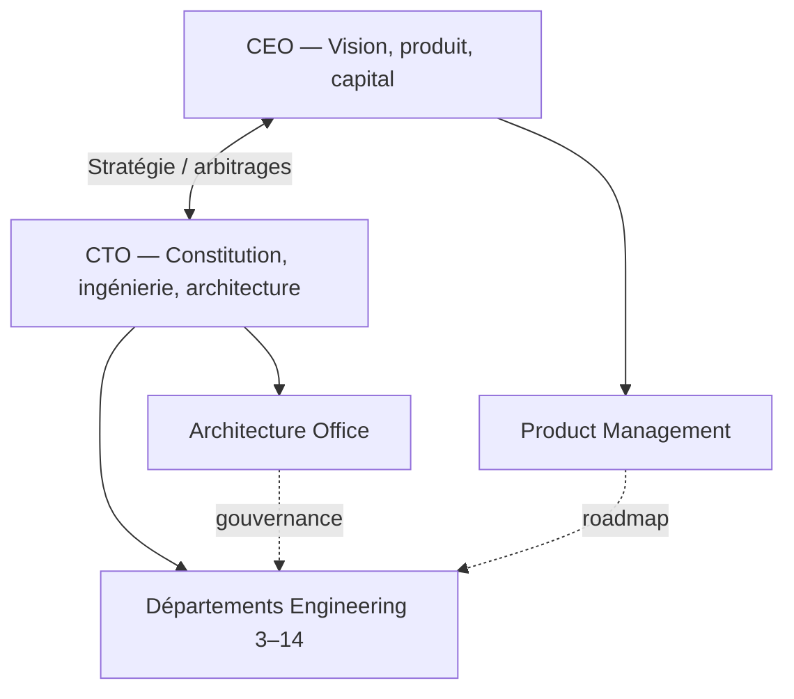
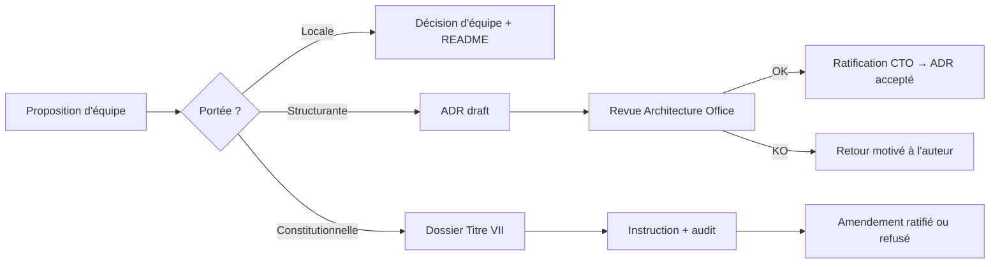
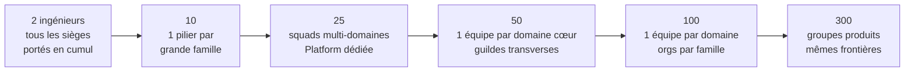

# Engineering Organization

**MentoraOS — Organisation officielle de l'ingénierie**

| | |
|---|---|
| **Version** | 1.0 |
| **Statut** | Référence officielle (Phase 3.1) |
| **Propriétaire** | CTO |
| **Autorité supérieure** | La Constitution Mentora (`docs/canon/`, tag `foundation-v1.0.0`) — Titre VII seule voie d'amendement |
| **Portée** | De 2 développeurs à 300+ ingénieurs, sans réorganisation |

---

## 0. Principes fondateurs

Cinq principes gouvernent toute cette organisation. Chaque section en découle.

1. **La Constitution est la loi.** L'organisation exécute la Constitution (`docs/canon/`), elle ne la légifère jamais. Aucune équipe — Executive Office compris — ne modifie une loi ratifiée autrement que par la procédure du Titre VII.
2. **Conway inversé : les équipes épousent les Bounded Contexts.** Une équipe backend = un domaine ratifié de F2. Les frontières d'équipes sont les frontières de contextes — jamais l'inverse. C'est la seule organisation nativement compatible DDD.
3. **Des sièges, pas des personnes.** L'organisation définit des *sièges* (seats) aux responsabilités fixes. Aujourd'hui, 2 personnes occupent tous les sièges ; à 300, chaque siège est une équipe. **On remplit les sièges, on ne réorganise jamais.**
4. **Une vérité = un propriétaire.** Chaque domaine, chaque contrat, chaque document, chaque décision a exactement un propriétaire. Le partage de propriété est interdit ; la consultation est libre.
5. **Interfaces contractuelles seulement.** Les équipes collaborent par contrats publiés (events du dictionnaire F2, ports, ADR, RFC) — jamais par accès direct aux internes d'une autre équipe.

### 0.1 Réconciliation du vocabulaire (mandat → canon)

Le présent document utilise exclusivement le vocabulaire ratifié. Les noms d'équipes cités « par exemple » dans le mandat de la Phase 3.1 sont tracés vers leur propriétaire constitutionnel :

| Nom du mandat | Propriétaire ratifié (F2) | Justification |
|---|---|---|
| Booking | **Engagement** (`Agreement`) | Le cycle demande→accord→rencontre appartient à Engagement |
| Payments / Wallet | **Economy** + **Settlement** | `FundsLedger`/`PayoutRecord`/`Goal` (Economy) ; ordres de règlement (Settlement) |
| Messaging | **Conversations** | Le mot *Messaging* est réservé au domaine Conversations (F4.3) |
| Users | **Account** | Comptes, cadres de disponibilité, abonnements, support |
| Experts | **Professional Identity** | Identité professionnelle, offres, registre de spécialités |
| Marketplace / Search | **Discovery** | L'intérêt client et la découverte appartiennent à Discovery |
| Identity | **Identity & Access** | `Credential`, `Session` |
| Notifications | **Notification** | Le `Signal` et ses canaux |
| Media | **Storage** | Le `Deposit` ; « une personne emporte, l'adoptant re-dépose » |
| AI Gateway | **Augmentation** | La `Production` assistée ; la passerelle technique est un adapter |
| Video | *Capacité technique* | Le temps réel de la Rencontre = mécanisme (Platform), la vérité = Consultation |
| Admin | *Outillage d'exploitation* | La Flotte et la Maintenance (F5.1) = Platform + Internal Tools |
| Analytics | **Reputation** (`AudienceMeasurement`) + **Data Engineering** | La mesure d'audience est une vérité de domaine ; le décisionnel est une projection |
| Microservices | *Espèces d'exécutables (F5.1)* | La topologie de déploiement est un mécanisme libre ; la Constitution ratifie des espèces, pas des microservices |

---

## 1. Executive Office

### 1.1 Organigramme exécutif

### 1.2 CEO

| Axe | Contenu |
|---|---|
| **Responsabilités** | Vision produit et marché ; stratégie d'entreprise ; capital et financement ; partenariats ; arbitrage final des priorités business ; culture d'entreprise. |
| **Pouvoirs** | Décide du *quoi* et du *pourquoi* ; fixe la roadmap macro avec Product Management ; alloue les budgets ; recrute l'exécutif. |
| **Décisions typiques** | Lancement d'un marché, pricing, embauches exécutives, priorisation entre domaines (jamais à l'intérieur d'un domaine). |
| **Interactions** | Quotidiennes avec le CTO ; hebdomadaires avec Product Management ; jamais d'instruction directe à une équipe d'ingénierie (toujours via CTO ou PM). |
| **Limites** | Ne décide jamais du *comment* technique. Ne peut pas suspendre une loi constitutionnelle, une gate qualité, ni un refus de sécurité. Un impératif business qui contredit la Constitution passe par le Titre VII, pas par-dessus. |

### 1.3 CTO

| Axe | Contenu |
|---|---|
| **Responsabilités** | Gardien de la Constitution ; direction de toute l'ingénierie ; architecture d'ensemble ; qualité (gates) ; sécurité ; dette technique ; recrutement technique ; budget d'infrastructure. |
| **Pouvoirs** | Décide du *comment* ; ratifie les ADR structurants et les amendements Titre VII ; tranche tout conflit d'ownership ; peut opposer un veto technique à toute livraison ; nomme les propriétaires de domaines. |
| **Décisions typiques** | Ouverture d'un lot, gel d'un chapitre, ratification d'un contrat public, scission d'une équipe, choix d'un fournisseur d'infrastructure. |
| **Interactions** | Quotidiennes avec le CEO et l'Architecture Office ; revues d'architecture ; comités de sécurité ; il est l'unique interface entre l'exécutif et la Constitution. |
| **Limites** | Ne réécrit jamais l'histoire Git ; ne contourne jamais ses propres gates ; ne modifie pas le canon hors Titre VII ; ne décide pas des priorités business (CEO/PM). |

**Règle de séparation** : le CEO possède le *pourquoi*, PM le *quoi ordonné*, le CTO le *comment*, les équipes le *faire*. Toute décision qui traverse deux colonnes exige les deux signataires.

---

## 2. Architecture Office

| Axe | Contenu |
|---|---|
| **Mission** | Faire respecter la Constitution dans le code ; garantir que chaque frontière de contexte, chaque contrat et chaque décision d'architecture a un propriétaire, une trace et une justification. |
| **Responsabilités** | Gouvernance d'architecture ; tenue des ADR ; garde des Bounded Contexts ; registre des events ; revues d'architecture ; procédure RFC ; police du vocabulaire (dictionnaire bilingue F2.5) ; tests d'architecture exécutables (`testing-architecture`, ADR-0003). |
| **Ownership** | `docs/canon/` (matérialisation, sans pouvoir éditorial) ; `docs/architecture/` ; `docs/organization/` ; ADR ; RFC ; la carte des contextes ; le catalogue des 73 events ratifiés. |

### 2.1 Gouvernances

- **Architecture Governance** — trois niveaux de décision : *Constitutionnel* (lois, domaines, contrats → Titre VII, ratification CTO), *Structurant* (choix traversant plusieurs équipes → ADR + revue), *Local* (interne à une équipe → décision d'équipe, documentée dans son README).
- **ADR ownership** — l'Architecture Office possède le format, la numérotation et le registre ; l'auteur d'un ADR est l'équipe demandeuse ; la ratification d'un ADR structurant appartient au CTO. Un ADR ne contredit jamais le canon — s'il le doit, il devient un dossier Titre VII.
- **Bounded Context ownership** — chaque contexte des 15 a un propriétaire unique (l'équipe-domaine, §4). L'Architecture Office possède la *carte* (frontières, familles de dépendances, ACL, OHS) — jamais l'intérieur des contextes.
- **Event ownership** — chaque event appartient au domaine qui le publie (F2.2). Le registre des générations de contrats (V-1→V-6) appartient à l'Architecture Office ; l'évolution additive appartient au domaine ; toute suppression/renommage = nouveau contrat = Titre VII.

### 2.2 Architecture Review Process

Cadence : revue hebdomadaire ; tout ADR reçoit un verdict sous 2 revues ; silence ≠ accord.

### 2.3 RFC Process

Une RFC précède tout ADR dont l'espace de solutions est ouvert : problème → contraintes constitutionnelles citées → options (≥2) → recommandation → période de commentaires (1 semaine, écrite) → décision. Les RFC vivent dans `docs/canon/decisions/rfc/` ; les commentaires sont publics et archivés. Une RFC sans citation des lois applicables est irrecevable.

---

## 3. Platform Engineering

| Axe | Contenu |
|---|---|
| **Mission** | Faire exister, tourner et observer les exécutables de Mentora — sans jamais posséder une vérité métier. La plateforme sert les Séquences ; elle ne les juge pas (R-6). |
| **Ownership** | Monorepo outillage (`platform/` racine : turbo, pnpm, tsconfig, presets) ; paquets `runtime-*` (Runtime Foundation gelée) ; `apps/*` côté machinerie ; infrastructure ; environnements ; chaîne de build et de release. |

Sous-sièges (un responsable chacun ; cumulables) :

| Siège | Périmètre | Règles clés |
|---|---|---|
| **Infrastructure** | Réseau, calcul, bases (PostgreSQL), conteneurs Docker | L'infra de dev est jetable ; les données réelles ne quittent jamais la production (S-9) |
| **CI/CD** | GitHub Actions, gates (typecheck, lint, test, build, couverture) | La gate est la même partout ; « CI-identique » — aucun comportement spécial CI |
| **Observability** | Puits de logs, métriques, tracing, Relevés d'accès | Journal probant ≠ Log perdable (F5.3) ; aucun secret, aucune matière métier en télémétrie ; `SessionId` interdit en télémétrie |
| **Monitoring & Health** | /live /ready /health, alerting, la Flotte (F5.1) | Liveness ne juge jamais le backlog ; readiness = les trois Séquences exécutables |
| **Secrets** | Vault, `SecretReference` (discipline nom-seul, I-8) | Un seul lieu ; jamais dans un fichier commité ; dumps vault-grade |
| **Environments** | dev / staging / production ; parité expand-contract (S-7) | Le domaine est identique partout ; rollback = binaires, jamais les faits |
| **Developer Platform & Build** | pnpm workspace, turbo pipeline, presets vitest/eslint/tsconfig | hoist=false ; les presets sont la loi commune des paquets |
| **Release Engineering** | Versions, artefacts, preuve d'artefact au boot (intégrité/signature/provenance) | Un artefact non prouvé ne boote pas ; les espèces d'exécutables se scindent en production (F5.1 §3) |

**Ne lui appartient pas** : le contenu des Séquences, les contrats de domaines, les Policies produit, le canon.

---

## 4. Backend Engineering

**Loi d'organisation : une équipe = un domaine ratifié.** 15 équipes-domaines, groupées par familles F2.1 (6 cœur / 5 support / 4 génériques). Chaque équipe possède : son agrégat(s), ses events publiés, ses commandes, ses ports, son paquet `application-*`/`domain-*`, ses adapters de persistance, ses projections propres. Aucune équipe n'importe les internes d'une autre : uniquement les contrats publiés (events) via les ACL déclarées.

Format : **Mission / Possède / Interfaces publiques / Ne possède pas.**

### 4.1 Domaines cœur

| Équipe | Mission | Possède (unités F3) | Interfaces publiques | Ne possède pas |
|---|---|---|---|---|
| **Discovery** | L'intérêt du client rencontre l'offre : recherche, découverte, mise en relation | `ClientInterest` | Events Discovery ; queries de découverte | Le profil expert (Professional Identity), l'accord (Engagement) |
| **Professional Identity** | L'identité professionnelle publique : profils, offres, registre de spécialités | `ProfessionalIdentity`, `Offer`, `SpecialtyRegistry` | Events d'offre et de profil ; registre des spécialités | Le compte (Account), la réputation (Reputation) |
| **Engagement** | Le cycle demande → accord : créneaux, report, annulation, caducité | `Agreement` (+ clé R-A des créneaux confirmés) | 8 commandes ratifiées ; `AgreementStateQuery` ; events d'accord | La rencontre elle-même (Consultation), l'argent (Economy/Settlement) |
| **Consultation** | La rencontre vécue et son suivi | `Encounter`, `FollowUp` | Events de rencontre (RencontreInterrompue incluse) | L'accord amont, le règlement aval |
| **Reputation** | La confiance prouvée : avis, certifications, accomplissements, audience | `Review`, `CertificationRecord`, `AchievementRecord`, `AudienceMeasurement` (append-only) | Events de réputation ; police des registres (AvisSignalé/SignalementTranché) | Le « SignalDeConfiance » (mort en F2.2.99 : c'est une projection) |
| **Economy** | Les fonds et leurs mouvements ; les retraits (Payout) ; les objectifs | `FundsLedger`, `PayoutRecord`, `Goal` (`AvailableFunds`/`Opportunity` = projections) | Events économiques ; RetraitÉchoué/SuiteTraitée | L'ordre de règlement (Settlement), le prix des offres (Professional Identity) |

### 4.2 Domaines support

| Équipe | Mission | Possède | Interfaces publiques | Ne possède pas |
|---|---|---|---|---|
| **Account** | Le compte de la personne : disponibilité, abonnement, support | `Account`, `AvailabilityFrame`, `Subscription`, `SupportRequest` | Events de compte ; OHS Compte | L'identité professionnelle publique, les credentials (I&A) |
| **Enterprise** | Les organisations : invitations, membres, parrainages, vérification | `Organization`, `Invitation`, `Membership`, `Sponsorship`, `OrganizationVerification` | Events d'organisation | Les comptes individuels (Account) |
| **Consent** | Le registre des consentements — 5 faits ; `Expired`/`Withdrawn` réservés | `ConsentLedger` | OHS Consentement | L'usage des données consenties (chaque domaine consommateur) |
| **Conversations** | L'échange entre personnes ; le mot *Messaging* lui est réservé | `Conversation` | Events de conversation ; `ConversationVerdictRendered` | La notification technique (Notification) |
| **Augmentation** | La production assistée par IA — la vérité de ce qui a été produit | `Production` | Events de production ; chaîne d'adoption (provenance `ProductionId`+`DepositId`) | Les modèles et la passerelle technique (AI Engineering §7), le dépôt (Storage) |

### 4.3 Domaines génériques

| Équipe | Mission | Possède | Interfaces publiques | Ne possède pas |
|---|---|---|---|---|
| **Identity & Access** | Qui est là et avec quel droit d'entrée | `Credential`, `Session` | Vérification de session au gateway (session seulement — les droits métier au dispatch, M-10) | Les droits métier (chaque domaine) |
| **Settlement** | L'ordre de règlement et son exécution | `SettlementOrder` | Events de règlement ; arête Engagement→Settlement | Le solde des fonds (Economy) |
| **Notification** | Le `Signal` porté aux personnes, multi-canal | `Signal` | Commandes de signal | Le contenu des vérités signalées (domaines émetteurs) |
| **Storage** | Le `Deposit` : dépôt, adoption, cycle de vie des objets | `Deposit` | Events de dépôt ; « l'adoptant re-dépose, jamais de copie inter-domaines » | L'interprétation du contenu déposé |

**Règles transverses backend** : trois Séquences seulement (Commande/Lecture/Réaction — aucun quatrième chemin) ; trois canaux jamais mélangés (Refus=valeur, Exception=défaut d'appelant, Failure=technique borné) ; Outbox de faits par domaine, Inbox par consommateur ; l'ordre n'est promis que par sujet d'unité ; toute équipe nouvelle naît avec sa contract suite et sa gate à ≥95 %.

---

## 5. Frontend Engineering

| Siège | Mission | Possède | Règles |
|---|---|---|---|
| **Web Team** | L'application web cliente | App web, ses routes, son state management | Parle aux BFF/dispatchs publiés ; jamais un port de domaine en direct |
| **Admin Team** | Les surfaces internes d'exploitation | Apps d'admin (Flotte, quarantaine, replays outillés) | L'admin agit par commandes ratifiées — jamais d'écriture directe en base |
| **Landing Pages** | Acquisition, pages publiques | Sites statiques, CMS éventuel | Zéro dépendance au runtime métier |
| **Design Integration** | Fidélité au Design System | Intégration des tokens/composants (§11) | N'invente aucun composant hors système |
| **SSR** | Rendu serveur des surfaces qui l'exigent | Config SSR, hydratation | SSR = mécanisme ; aucune logique métier dans le rendu |
| **SEO** | Visibilité organique | Métadonnées, sitemaps, données structurées | Ne déforme jamais un contenu ratifié |
| **Performance** | Budgets de perf front | Budgets (LCP/CLS/TTI), audits, CI perf | Un budget cassé bloque la release comme un test rouge |

---

## 6. Mobile Engineering

| Axe | Contenu |
|---|---|
| **Stack** | Flutter (l'app historique du dépôt reste la racine Flutter ; « Flutter matérialise » — mécanisme, jamais une vérité, P11.9.1) |
| **Architecture** | Modules par domaine, alignés sur les 15 contextes ; la couche réseau parle aux mêmes contrats publiés que le web |
| **Modules** | Un module Flutter = un domaine consommé ; aucune logique de domaine dupliquée dans l'app |
| **Offline** | File locale de commandes en attente = *enveloppes*, jamais des vérités ; la vérité naît à la rétention serveur ; réconciliation par les events |
| **Notifications** | Réception des `Signal` (domaine Notification) ; le mobile n'invente jamais un signal |
| **Store Releases** | Trains de release réguliers ; feature flags produit = configuration PRODUIT gouvernée (jamais un flag caché qui gouverne le métier, F4.4) |

---

## 7. AI Engineering

Distinction constitutionnelle : **la vérité de la production assistée appartient au domaine Augmentation (§4.2)** ; AI Engineering possède les *mécanismes*.

| Siège | Possède | Règles |
|---|---|---|
| **LLM Serving** | Intégrations fournisseurs, quotas, fallbacks | Fournisseur = adapter interchangeable derrière un port |
| **Embeddings** | Pipelines d'embeddings (pgvector) | Les vecteurs sont des projections rebuildables — jamais la vérité |
| **RAG** | Récupération, chunking, index | Ne lit que des contenus autorisés (Consent respecté à la source) |
| **Recommendation Engine** | Modèles de reco pour Discovery | La reco propose ; Discovery possède la vérité de l'intérêt |
| **Prompt Engineering** | Bibliothèque de prompts versionnée | Un prompt en production est versionné et évalué comme du code |
| **Voice AI** | STT/TTS pour la Rencontre | Mécanisme de Consultation ; aucune rétention hors Consent |
| **Model Evaluation** | Jeux d'éval, métriques, seuils de régression | Aucun modèle ne remplace l'ancien sans éval comparative verte |
| **AI Gateway** | La passerelle technique unique vers les modèles | Tout appel modèle passe par elle : quotas, coûts, traçage, PII-guard |
| **AI Observability** | Coûts, latences, dérives, taux de refus | Jamais de matière personnelle dans les traces (mêmes lois que §3) |

---

## 8. Security Engineering

| Siège | Périmètre | Règles constitutionnelles |
|---|---|---|
| **Authentication** | Avec I&A : credentials, sessions | Le gateway vérifie la session seulement (M-10) |
| **Authorization** | Modèle de droits ; revue des `RightsCheck` | Les droits métier se jugent au dispatch, dans le domaine |
| **Secrets** | Politique vault, rotation, `SecretReference` (I-8) | Un secret dans un commit = incident, révocation immédiate |
| **Encryption** | Chiffrement en transit et au repos | Les clés vivent au vault, jamais en config |
| **Compliance** | RGPD : effacement (ErasureProcess), consentement, portabilité | L'effacement est un journey ratifié, pas un script |
| **Audit** | Journal probant, Relevés d'accès, preuves | Le Journal n'est jamais échantillonné (F5.3) |
| **Threat Modeling** | Modèles de menace par domaine, revus à chaque contrat nouveau | Un nouveau contrat public sans threat model n'est pas ratifiable |
| **Security Reviews** | Revue de chaque lot touchant auth/argent/données personnelles | Peut opposer un veto bloquant ; le veto remonte au CTO seul |

---

## 9. QA Engineering

QA ne « teste pas après » : QA possède la **stratégie de preuve** que chaque équipe exécute elle-même.

| Siège | Contenu | Règle |
|---|---|---|
| **Unit Testing** | Presets vitest, standards de doubles (Mothers, Fixtures) | Couverture ≥95 % statements/branches/functions par paquet |
| **Integration Testing** | Bases réelles jetables (PostgreSQL), contract suites | Une contract suite par port ; rejouée sur chaque implémentation réelle |
| **End-to-End** | Boucles complètes (commande→rétention→relais→lecture) | La boucle e2e du serveur est la référence du genre |
| **Regression** | Gel des comportements ; tout bug corrigé laisse un test | Un bug sans test de non-régression n'est pas clos |
| **Performance** | Budgets de latence par Séquence | Mesuré en continu, pas à la veille des releases |
| **Load Testing** | Tenue en charge des exécutables et du relais | Sur environnement dédié, données de spec uniquement (S-9) |
| **Release Validation** | La gate froide complète (0 erreur, 0 warning, 0 cache) | « Ne jamais dire terminé sans avoir exécuté toute la gate » |

---

## 10. Developer Experience

| Siège | Possède |
|---|---|
| **Templates** | Gabarits de paquets (`domain-*`, `application-*`, `adapters-*`), gabarits ADR/RFC |
| **CLI** | Outillage en ligne de commande interne (scaffolding, replays outillés) |
| **Generators** | Générateurs de nouveaux domaines conformes (structure, gate, contract suite incluses) |
| **Documentation DX** | Guides « premier jour », « premier lot », « première Séquence » |
| **Scaffolding** | Un nouveau domaine naît en < 1 heure, gate verte incluse |
| **Automation** | Hooks, vérifications locales, réduction des frictions répétées |
| **Developer Tooling** | Presets eslint (règles MENTORA), configs IDE partagées |

Mesure de succès unique : **le temps entre « idée de lot » et « première gate verte »**.

---

## 11. Design System Team

| Axe | Contenu |
|---|---|
| **Components** | Bibliothèque unique multi-plateforme (web + Flutter) ; chaque composant a états, variantes, docs |
| **Tokens** | Couleurs, typo, espacements, élévations — source unique, exportée vers toutes les cibles |
| **UI Library** | Paquet versionné, consommé par Web/Admin/Mobile ; breaking change = major + migration guide |
| **Accessibility** | WCAG 2.1 AA minimum ; l'audit a11y fait partie de la definition of done des composants |
| **Design Governance** | Tout nouveau pattern passe par le système ; les équipes proposent, le système ratifie ; le vocabulaire visuel suit le dictionnaire bilingue (mêmes mots que F2.5) |

---

## 12. Documentation Team

Discipline héritée du principe R2-Corpus : **la documentation reproduit la dernière source ratifiée ; elle n'a aucun pouvoir éditorial.**

| Siège | Possède | Règle |
|---|---|---|
| **Architecture Docs** | `docs/architecture/`, `platform/docs/engineering/` (Blueprints, RC-1..RC-6) | Miroir des décisions, jamais leur origine |
| **API Docs** | Référence des contrats publics par domaine | Générée depuis les contrats, jamais écrite à la main en divergence |
| **ADR** | Le registre (avec l'Architecture Office §2) | Un ADR accepté est immuable ; on le remplace, on ne l'édite pas |
| **RFC** | L'archive des RFC et de leurs commentaires | Rien ne se décide hors trace écrite |
| **Onboarding** | Parcours d'entrée : Constitution → dictionnaire → premier lot | Un nouvel ingénieur lit le canon avant d'écrire du code |
| **Playbooks** | Procédures produit-équipe (revues, rituels, gates) | |
| **Runbooks** | Procédures d'exploitation (incidents, replays, quarantaine) | Les actes d'exploitation passent par les commandes ratifiées du registre |

---

## 13. Product Management

| Axe | Contenu | Limite constitutionnelle |
|---|---|---|
| **Roadmap** | Trimestre glissant, arbitrée CEO×CTO | Une roadmap ne promet jamais un contrat non ratifié |
| **Backlog** | Par domaine, priorisé avec l'équipe-domaine | PM priorise, l'équipe estime — jamais l'inverse |
| **Epics** | Un epic vit dans un domaine ; un epic transverse est découpé par contextes | Aucun epic « à cheval » sans contrat entre domaines |
| **Features** | Décrites dans le vocabulaire du dictionnaire bilingue | Un mot hors dictionnaire = ticket au vocabulaire, pas une invention |
| **User Stories** | Critères d'acceptation exprimés en events/Refus ratifiés | « Refusé » est un résultat de valeur, pas un bug |
| **Sprint Planning** | Cadence par équipe ; les dépendances inter-domaines se contractualisent en events | Pas de dépendance de sprint sans contrat publié |

---

## 14. Data Engineering

Frontière constitutionnelle : **les vérités appartiennent aux domaines ; Data ne possède que des projections rebuildables.**

| Siège | Possède | Règle |
|---|---|---|
| **Analytics** | Pipelines d'événements analytiques | Consomme les events publiés via Inbox propre — jamais les tables des domaines |
| **Warehouse** | L'entrepôt décisionnel | Reconstructible depuis les faits ; sa perte n'est jamais une perte de vérité |
| **ETL / ELT** | Ingestion, transformations, qualité de données | Idempotent, rejouable ; dédup par Inbox (A-5) |
| **Metrics** | Définitions canoniques des métriques business | Une métrique = une définition, un propriétaire, une formule versionnée |
| **Business Intelligence** | Modèles décisionnels | Anonymisation aval du Consent ; jamais de matière interdite |
| **Dashboards** | Tableaux de bord d'entreprise | Projections d'exploitation ; jamais une source de vérité |

---

## 15. Interaction Matrix

**Règle de lecture** : toute équipe peut *parler* à toute équipe (la communication est libre) ; ce tableau régit les **dépendances de production** — qui peut dépendre des artefacts de qui, et qui valide quoi.

| Équipe ↓ dépend de → | Domaines backend | Platform | Architecture Office | Security | Design System | QA | Data |
|---|---|---|---|---|---|---|---|
| **Domaines backend** | Events publiés seulement (jamais les internes) | ✔ runtime, gates | Valide contrats/ADR | Veto sécurité | — | Stratégie de preuve | — |
| **Frontend / Mobile** | Contrats publics (BFF/dispatch) | ✔ | ADR structurants | Auth flows | ✔ composants/tokens | e2e | — |
| **AI Engineering** | Augmentation (vérité) | ✔ | ADR | PII-guard | — | évals | corpus autorisés |
| **Platform** | — (ne dépend d'aucun domaine) | — | ADR infra | Secrets/vault | — | gates | — |
| **Data** | Events publiés (Inbox propre) | ✔ | Schémas de contrats | Anonymisation | — | qualité données | — |
| **Design System** | — | build | — | — | — | a11y | — |
| **Documentation** | Sources ratifiées | — | Registre ADR/RFC | — | — | — | — |
| **PM** | Vocabulaire + events | — | Faisabilité | — | — | — | métriques |

**Qui valide quoi** :

| Décision | Validateur |
|---|---|
| Contrat public (event, commande, query) | Domaine propriétaire + Architecture Office ; ratification CTO |
| Amendement constitutionnel | Titre VII (instruction + audit + CTO) |
| ADR structurant | Architecture Office → CTO |
| Release en production | Gate complète (QA) + Security si périmètre sensible + Release Engineering |
| Nouveau composant UI | Design System Team |
| Nouvelle métrique business | Data Engineering + PM |
| Modification de schéma persisté | Domaine propriétaire + règle expand-contract (S-7, Platform) |

---

## 16. Ownership Matrix

Repository unique : **`MentoraOS/mentora`** (monorepo). La propriété s'exprime par chemins (CODEOWNERS, phase GitHub Governance à venir). La colonne « Exécutables » remplace « Microservices » (cf. §0.1) : les espèces F5.1 sont la topologie ratifiée, leur découpe en services est un mécanisme libre.

| Équipe | Responsabilité | Chemins (repo) | Domaines | Paquets | Exécutables |
|---|---|---|---|---|---|
| Architecture Office | Constitution, ADR, RFC, carte des contextes | `docs/canon/`, `docs/architecture/`, `docs/organization/` | (tous, en carte) | `testing-architecture` | — |
| Platform | Runtime, build, CI/CD, infra, observabilité | `platform/` (racine), `platform/packages/runtime-*`, `platform/tooling/` | — | `runtime-clock/identity/config/logging/metrics/tracing/health/serialization/security/bootstrap/relay`, presets | `app-server` (machinerie), futures espèces Relay/Scheduler/Worker/Migration/Maintenance |
| Équipe Engagement | Cycle demande→accord | `platform/packages/*agreement*` | Engagement | `domain-agreement`, `application-agreement`, `contracts-agreement`, `adapters-persistence-agreement` | `app-server` (contenu métier) |
| Équipes des 14 autres domaines | Leur contexte | `platform/packages/*<domaine>*` (à naître) | Discovery, Professional Identity, Consultation, Reputation, Economy, Account, Enterprise, Consent, Conversations, Augmentation, I&A, Settlement, Notification, Storage | `domain-*`, `application-*`, `contracts-*`, `adapters-*` par domaine | par espèce |
| Kernel/Contracts (Architecture Office) | Socle commun | `platform/packages/{kernel,shared,contracts,application-kernel}` | — | `kernel`, `shared`, `contracts`, `application-kernel` | — |
| Frontend | Surfaces web | `apps/web`, `apps/admin` (à naître) | — | UI apps | web, admin |
| Mobile | App Flutter | racine Flutter (`lib/`, `android/`, `ios/`…) | — | modules Flutter | app mobile |
| AI Engineering | Mécanismes IA | `platform/packages/ai-*` (à naître) | (mécanismes d'Augmentation) | `ai-gateway`, `ai-eval`… | passerelle IA |
| Security | Politiques, revues | transversal (droit de revue) | — | `runtime-security` (avec Platform) | — |
| QA | Stratégie de preuve | `platform/packages/testing*` | — | `testing`, `testing-config/clock/id/contracts/performance` | — |
| DX | Outillage développeur | `platform/tooling/` | — | generators, CLI | — |
| Design System | UI partagée | `packages/design-system` (à naître) | — | tokens, composants | — |
| Documentation | Docs non-canoniques | `docs/` (hors canon), `platform/docs/` | — | — | — |
| Data | Projections décisionnelles | `data/` (à naître) | — | pipelines | warehouse |

---

## 17. Future Scalability

**Le mécanisme unique : les sièges sont fixes, les personnes se répartissent.** À chaque palier, on scinde l'*occupation* des sièges — jamais les frontières. Les frontières (15 domaines + sièges plateforme) sont déjà celles de la Constitution ; elles ne bougent que par Titre VII.

| Palier | Organisation | Ce qui change | Ce qui ne change jamais |
|---|---|---|---|
| **2 → 10** | 1 pilier par grande famille : Customer Journey (Discovery→Reputation), Trust & Money (Economy/Settlement/Consent), Platform, Front/Mobile. Chacun cumule plusieurs sièges de §4. | Les cumuls se réduisent ; premiers rôles dédiés Platform et QA. | Les 15 domaines, les gates, l'ownership des contrats. |
| **10 → 25** | Squads stream-aligned de 3-5 couvrant 2-4 domaines voisins ; Platform devient une équipe réelle ; Architecture Office = CTO + 1 staff. | PM dédié ; Security et DX deviennent des sièges à temps plein. | Le processus ADR/RFC — il est déjà dimensionné. |
| **25 → 50** | Un domaine cœur = une équipe ; domaines support/génériques groupés 2 par squad ; guildes transverses (QA, Security, a11y). | Design System et Documentation deviennent des équipes ; premiers Staff Engineers par famille. | La matrice d'interaction — elle est déjà contractuelle. |
| **50 → 100** | Chaque domaine a son équipe (la cible §4 est atteinte, pas créée) ; Engineering Managers par famille ; AI et Data en départements pleins. | Management intermédiaire ; comités de ratification élargis (le CTO délègue l'instruction, garde la ratification). | Une équipe = un contexte ; une vérité = un propriétaire. |
| **100 → 300** | Groupes produits par famille F2 (Core Journey, Trust & Money, Platform, Experience, Intelligence) ; plusieurs équipes par domaine à forte charge (par *capacité*, jamais par fork de la vérité) ; Principal Engineers par groupe. | Fleet multi-région ; l'exploitation (la Flotte) devient une organisation. | Les frontières de contextes, le dictionnaire, la Constitution — un ingénieur de 2026 reconnaît l'organisation de 2030. |

**Pourquoi ça ne casse pas** : chaque palier n'est qu'un changement de *cardinalité* (combien de personnes par siège), jamais de *topologie* (quels sièges existent et qui possède quoi). La topologie est dérivée d'un texte gelé ; tant que la Constitution tient, l'organisation tient.

---

*Document ratifiable par le CTO. Toute évolution passe par une révision versionnée de ce document ; toute évolution qui toucherait une frontière de domaine passe par le Titre VII.*
