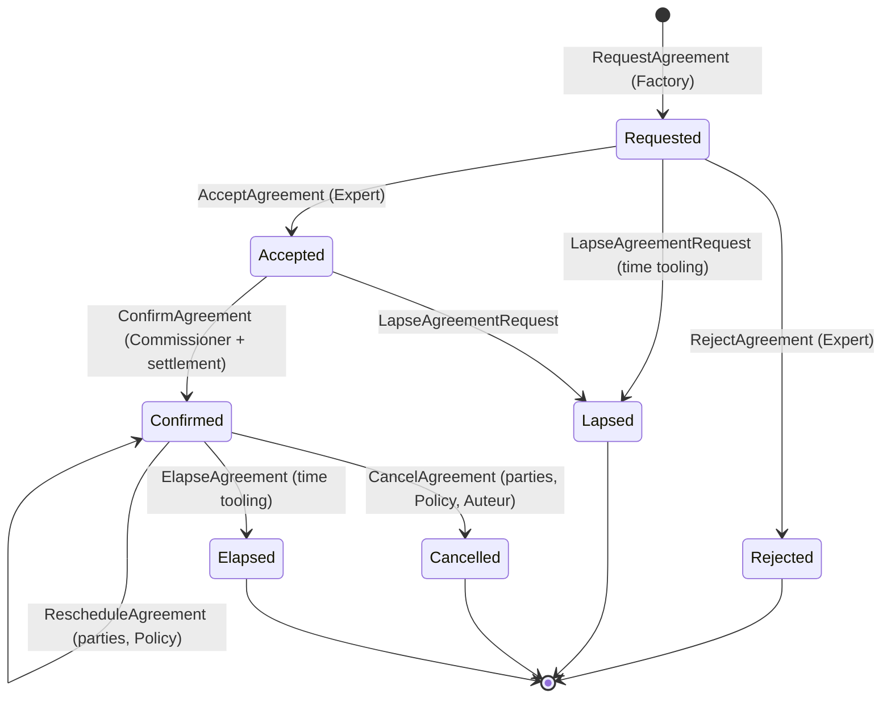

# @mentora/domain-agreement

**The Agreement domain — the golden path of Mentora.** The first business code
of the platform, and the reference every future domain copies. It implements,
without invention, the frozen design of the **Engagement** bounded context
(R2 [F3.2-A, Domaine 3](../../../docs/canon/source/domain/02-aggregates-customer-journey.md)).

> Pure business truth: **no framework, no I/O, no adapter, no DTO** (F4.4 I-7,
> F2.5 §9). The only port is the registry. Governed by
> `@mentora/eslint-plugin-mentora` (constitution config) from birth.

## The truth

*« L'accord d'un moment entre un Client et un Expert, de la demande à
l'échéance »* (F2.5 §2). One aggregate — `Agreement` — born at the Demande
(*« la demande est sa jeunesse ; la scission est interdite »*), with **two
refusing actors** (Client, Expert) on the same truth.

## The frozen state machine (F3.3 §8 — sole owner of the transitions)



Four terminals, **irreversible** (R-B: coming back is a NEW Demande). Forbidden:
Confirmed→Rejected, anything→Requested, terminal→anything.

## Contents (exactly what R2 froze — nothing more)

| Kind | Items | R2 source |
|------|-------|-----------|
| Aggregate | `Agreement` (+ `AgreementFactory`, the birth door) | F3.2-A |
| Value Objects | `TimeSlot`, `AgreementConditions` (cites `OfferId`), `CancellationRecord`, `RescheduleRecord`, `AgreementState`, `AgreementParty` | F3.2-A, F2.5 §3 |
| Identity | `AgreementId` (+ referenced ids: `OfferId`, `ClientId`, `ExpertId`; `CommandId` = act identity) | F3.1.99 §4, F4.1 §3 |
| Commands (8) | Request · Accept · Reject · Confirm · Reschedule · Cancel · LapseAgreementRequest · Elapse | F2.5 §5, F3.2-A |
| Events (8) | Requested · Accepted · Rejected · RequestLapsed · Confirmed · Rescheduled · Cancelled · Elapsed | F2.5 §4 |
| Policies (4) | AgreementCancellationPolicy · ReschedulePolicy · AgreementRequestLapsePolicy · ConfirmationPolicy | F3.3 §6 |
| Specifications (3) | SlotWithinFrame · ConfirmableAgreement · OverlappingSlot (the R-A rule half) | F3.3 §7 |
| Port (1) | `AgreementRepository` (byId, byExpertAndWindow, retain-with-structural-refusal) | F3.2-A, R-A |
| Snapshot | `AgreementSnapshot` — **private to the registry** (F3.1.11) | F3.1.11, F5.2.99 |
| Entities | **none** (R2: « Entities : aucune ») | F3.2-A |
| Domain Services | **none** (R2: « zéro Domain Service » — le faux service supprimé) | F3.2-A |

## The invariants (formalized & tested — see `agreement-invariants.spec.ts`)

| # | Invariant | Law |
|---|-----------|-----|
| INV-1 | A TimeSlot exists only with start < end (VO door) | F3.1 |
| INV-2 | Only the frozen transitions exist | F3.3 §8 |
| INV-3 | L'Acceptation précède toute Confirmation | F2.6 [T] |
| INV-4 | Nulle Confirmation sans conditions accomplies, encaissement compris | F2.6 [É] |
| INV-5 | Terminals are irreversible; every late act is refused | R-B |
| INV-6 | One successful mutation = exactly one newborn fact, version +1 | F3.1.99 §3 |
| INV-7 | The clock never enters the unit — instants arrive as data | F3.1.99 §5 |
| INV-8 | Expert × overlapping **Confirmed** slots is unique — rule here (`OverlappingSlotSpecification`), key applied structurally by the registry, refusal `TimeSlotUnavailable` | R-A, F3.2-A |

## Decision discipline (F3.1.14)

Every command yields `Result<Agreement, AgreementRefusal>` — the **Decision**,
a value of full rank. A Refusal is motivated (`reason`), expected and healthy;
an **Exception** (`AgreementDomainException`) is reserved for malformed calls
(blank id, corrupt snapshot). Facts are **carried** by the unit
(`pendingFacts`), retained atomically with state by the registry (pas 8), and
published **after** retention by the Application layer (A-3/A-4) — never before.

## Dependency graph

```
domain-agreement ──► @mentora/kernel   (Result/Option, Instant, Id, guards)
                └──► @mentora/shared   (pure duration helpers)
```

Nothing else. No framework import can enter (MENTORA0016 is an error here).

## Signals to the CTO (rule: never invent — R2 decides)

1. **Bounded context name**: R2's domain is **Engagement** (F2.1 #3); this
   package was ordered as `domain-agreement`. Either ratify "package per
   aggregate" or rename to `domain-engagement` at Titre VII — signaled.
2. The mandate's example VOs `AgreementStatus` (Status banned — VD-0071),
   `AgreementParticipantId` (Participant reserved to the Rencontre — VD-0051),
   `AgreementExpiration` (Expired reserved to Consent — VD-0044),
   `Type/Version/Number/Title/Description/OwnerId/Date` **do not exist in the
   frozen design** and were NOT created.
3. The full **Reason family** (F2.5.2 §20) is not enumerated in the
   materialized corpus; the non-ratified reason names used here
   (`SlotBoundsInvalid`, `CancellationWindowClosed`, `RescheduleWindowClosed`,
   `RescheduleLimitReached`) follow the ratified `-Unavailable`/motivated
   pattern and await Titre VII ratification.
4. `AgreementConditions` content beyond the `OfferId` citation and the exact
   payload of the settlement evidence await the Offer/Settlement contracts
   packages — carried as minimal data, nothing invented.
5. Policy **parameters are product configuration** (F4.4 I-5): no default value
   is hardcoded; the composition root injects them.
